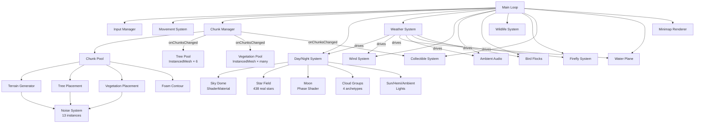
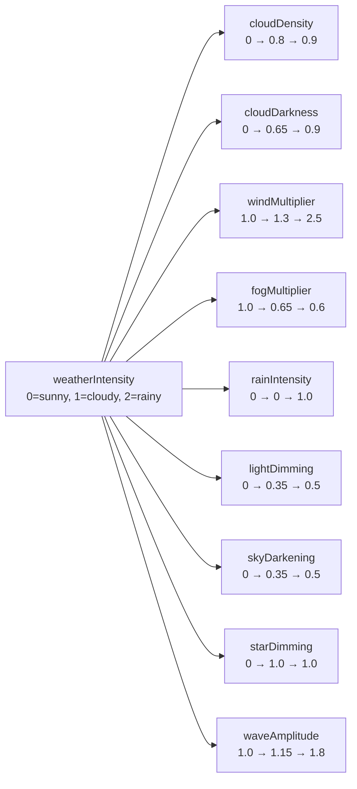
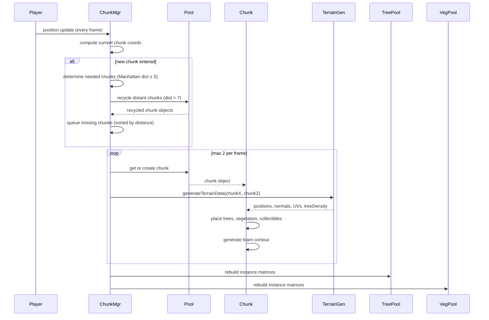
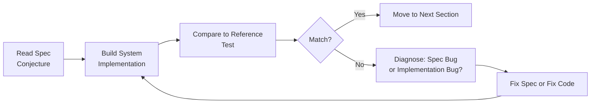
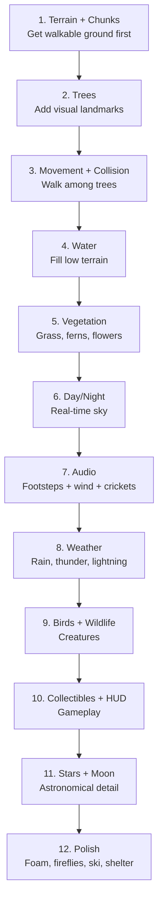

# VR Endless Forest — Technical Specification

## For Spec-Driven, AI-Assisted Development Education

**Version:** 1.0
**Date:** 20 February 2026
**Reference Implementation:** Three.js r170 + WebXR + Web Audio API

---

## Table of Contents

1. [Introduction](#1-introduction)
2. [Experience Overview](#2-experience-overview)
3. [Architecture](#3-architecture)
4. [Terrain System](#4-terrain-system)
5. [Water System](#5-water-system)
6. [Forest System](#6-forest-system)
7. [Wildlife](#7-wildlife)
8. [Atmosphere](#8-atmosphere)
9. [Audio System](#9-audio-system)
10. [Movement & Input](#10-movement--input)
11. [Collectibles & HUD](#11-collectibles--hud)
12. [Performance Budget](#12-performance-budget)
13. [Configuration Reference](#13-configuration-reference)
14. [Verification Guide](#14-verification-guide)

---

## 1. Introduction

### What This Document Is

This is a complete technical specification for a procedurally-generated VR forest experience. It describes every system, algorithm, parameter, and design decision in enough detail that a developer could rebuild the experience on any platform (Godot, Unity, Unreal, custom engine) without seeing the reference implementation's source code.

### The Teaching Methodology

This spec is used in an educational exercise built on Karl Popper's philosophy of **conjecture and refutation** applied to software:

1. **Students read only this spec** — they never see the Three.js source code
2. **They pick a platform** (Godot, Unity, etc.) and **rebuild the experience**
3. **Where their build diverges from the reference**, it's the **spec's fault** — the spec was ambiguous, incomplete, or wrong
4. **Improving the spec is part of the assignment** — students submit spec patches alongside their builds

The spec is the conjecture. Your implementation is the test. Divergence is falsification. Fixing the spec is science.

### How to Use This Document

- **Read Section 2 first** (Experience Overview) to understand what you're building
- **Read Section 3** (Architecture) to understand how systems relate
- **Then dive into individual systems** as you implement them
- **Section 13** (Configuration Reference) is your parameter bible — every magic number lives there
- **Section 14** (Verification Guide) tells you how to check your work

### Conventions

- All distances are in **meters**
- All angles are in **radians** unless noted as degrees
- Coordinate system: **+X = North, +Z = East, Y = Up** (this matters for astronomical calculations)
- Time values are in **seconds** unless noted otherwise
- Colours are given as normalised RGB (0–1) or hex (0xRRGGBB)

---

## 2. Experience Overview

Imagine putting on a VR headset and finding yourself standing in a forest clearing. It's whatever time of day it actually is where you are — if you play at sunset, the sky blazes orange. If you play at midnight, you're in darkness.

**The terrain** rolls away in every direction — gentle hills carpeted in grass, punctuated by clusters of pine, oak, and birch trees. Walk in any direction and the world keeps generating. After a few minutes you notice stream channels winding between the hills, with sandy shores where the terrain dips below the water level. The streams connect into ponds that shimmer with multi-directional waves.

**The mountains** appear as you walk further from the origin. Ridge after ridge of peaks rise from the landscape, transitioning through altitude zones: dark subalpine forest, tussock grassland, exposed alpine rock, and finally snow. The snow is bright — almost glowing — and when you walk on it, your movement changes: reduced friction lets you ski downhill, carving through powder with momentum.

**The sky** is accurate. The sun's position is calculated from your real clock and GPS coordinates (Auckland, New Zealand as fallback). Stars are real constellations — 438 stars from the HYG database, placed at their correct J2000 equatorial positions and rotated by local sidereal time. From the southern hemisphere, you can find the Southern Cross. The moon tracks its real orbital position with a photograph-based phase shader.

**Weather changes.** The system auto-cycles between sunny, cloudy, and rainy states over 3–8 minute intervals. During storms, rain falls as thin vertical streaks (or snow above the snowline), thunder cracks with 5-layer procedural audio through a convolver reverb, lightning bolts flash with jagged geometry, and the ground gradually darkens with wetness. Under dense tree canopy, rain is mostly blocked — you can shelter from the storm.

**Sound is everywhere.** Footsteps change with the surface — soft thuds on grass, sharp taps on rock, squelching slosh in water, crunchy crunch in snow. Crickets chirp at dusk (4200–5400 Hz sine waves). Bird flocks circle overhead with harsh crow caws. At night, from somewhere distant in the trees, a morepork owl calls — New Zealand's native owl — and another answers from a different direction.

**Small details.** Fairy-like collectible orbs glow and flutter in seven colours. Fallen logs and tree stumps litter the forest floor. Fireflies pulse at night. Occasionally, a bear, mountain lion, or Where's Wally peeks out from behind a tree, watches you for a few seconds, then hides again.

**Everything is procedural.** No 3D models, no pre-made textures (except one moon photograph with a procedural fallback), no pre-recorded sounds (except one owl call). Every texture is painted on a canvas at startup. Every sound is synthesised from oscillators, noise, and filters. The entire project is ~450KB of code.

---

## 3. Architecture

### System Overview



### Module Structure

| Module | Role | Key Exports |
|--------|------|-------------|
| `config.js` | All tunable constants (~170 parameters) | `CONFIG` object |
| `vr-setup.js` | WebXR renderer, camera rig, controllers | `VRSetup` class |
| `input.js` | VR gamepad + keyboard/mouse input abstraction | `InputManager` class |
| `movement.js` | Player locomotion, physics, collision | `MovementSystem` class |
| `terrain/noise.js` | 13 seeded simplex noise instances | `getTerrainHeight()`, density functions |
| `terrain/terrain-generator.js` | Height, normal, UV generation per chunk | `generateTerrainData()` |
| `terrain/chunk.js` | Per-chunk mesh + object placement | `Chunk` class |
| `terrain/chunk-manager.js` | Dynamic chunk loading/unloading | `ChunkManager` class |
| `terrain/ground-material.js` | Shared ground material + procedural textures | `getGroundMaterial()` |
| `forest/tree-factory.js` | 3 procedural tree geometries + materials | Geometry/material getters |
| `forest/tree-pool.js` | InstancedMesh tree rendering | `TreePool` class |
| `forest/vegetation.js` | Grass, ferns, flowers, rocks, logs, foam | `VegetationPool` class |
| `forest/textures.js` | Procedural canvas textures | Texture creators |
| `forest/birds.js` | Bird flock visual + crow audio | `BirdFlockSystem` class |
| `forest/wildlife.js` | Bear, lion, Wally peek encounters | `WildlifeSystem` class |
| `forest/collectibles.js` | Fairy orbs with collection mechanics | `CollectibleSystem` class |
| `atmosphere/day-night.js` | Sun/moon/stars, sky, palettes, clouds | `DayNightSystem` class |
| `atmosphere/star-catalog.js` | 438 real stars packed as binary catalog | `getStarCatalog()` |
| `atmosphere/weather.js` | Weather state machine, rain, thunder, lightning | `WeatherSystem` class |
| `atmosphere/audio.js` | All procedural audio | `AmbientAudio` class |
| `atmosphere/fireflies.js` | Night-time glowing particles | `FireflySystem` class |
| `atmosphere/wind.js` | Vertex shader wind displacement | `addWindToMaterial()`, `updateWind()` |

### Data Flow: Weather → Everything

Weather is the most interconnected system. A single `weatherIntensity` float (0–2) drives all weather parameters:



Other systems **pull** from weather each frame — weather never pushes. This keeps coupling minimal.

### Weather State Machine

```mermaid
stateDiagram-v2
    [*] --> Sunny: startup
    Sunny --> Transitioning_Up: holdTimer expired
    Transitioning_Up --> Cloudy: weatherIntensity reaches 1.0
    Cloudy --> Transitioning_Up2: holdTimer expired (50% chance)
    Cloudy --> Transitioning_Down: holdTimer expired (50% chance)
    Transitioning_Up2 --> Rainy: weatherIntensity reaches 2.0
    Transitioning_Down --> Sunny: weatherIntensity reaches 0.0
    Rainy --> Transitioning_Down2: holdTimer expired
    Transitioning_Down2 --> Cloudy: weatherIntensity reaches 1.0
    
    note right of Sunny: Hold 3-8 min
    note right of Cloudy: Hold 3-8 min
    note right of Rainy: Hold 3-8 min
    note left of Transitioning_Up: Rate: 0.0083/s (~2 min)
```

### Chunk Lifecycle



### Audio Signal Flow

```mermaid
graph TB
    subgraph "Footsteps"
        FS_Heel[Heel Oscillator] --> FS_Mix[Footstep Mixer]
        FS_Toe[Toe Oscillator] --> FS_Mix
        FS_Tex[Texture Noise] --> FS_BP1[Bandpass] --> FS_Mix
    end
    
    subgraph "Ambient"
        Wind_N[Noise Buffer] --> Wind_BP[Bandpass 250-650Hz] --> Wind_G[Gain LFO]
        Cricket_Osc[4× Sine 4200-5400Hz] --> Cricket_G[Gain Envelope]
        Water_N[Noise Buffer 0.3×] --> Water_BP[Bandpass 280Hz] --> Water_LP[Lowpass 400Hz] --> Water_Env[Wave Envelope]
    end
    
    subgraph "Rain"
        R1[Noise 0.6×] --> R1_BP[BP 800Hz] --> Rain_Mix[Rain Mixer]
        R2[Noise 0.9×] --> R2_BP[BP 1600Hz] --> R2_LFO[LFO 0.15Hz] --> Rain_Mix
        R3[Noise 1.2×] --> R3_BP[BP 3200Hz] --> Rain_Mix
        R4[Noise 1.8×] --> R4_HP[HP 6000Hz] --> R4_LFO[LFO 0.22Hz] --> Rain_Mix
    end
    
    subgraph "Thunder"
        T1[Noise 1.8-2.3×] --> T1_HP[HP 2000Hz] --> Thunder_Mix[Thunder Mixer]
        T2[Noise 0.15-0.25×] --> T2_LP[LP 120-200Hz] --> Thunder_Mix
        T3[Noise 0.35-0.5×] --> T3_BP[BP 180-280Hz] --> Thunder_Mix
        T4[Noise 0.2-0.35×] --> T4_BP[BP descending] --> Thunder_Mix
        T5[Sine 35-50Hz] --> Thunder_Mix
        Thunder_Mix --> Convolver[ConvolverNode<br/>5s impulse response]
    end
    
    subgraph "Spatial"
        Bird_Saw[Sawtooth] --> Bird_BP[BP 600Hz] --> Bird_Pan[HRTF Panner]
        Bird_Sq[Square 1.01×] --> Bird_BP
        Drip_Sin[Sine 2-5kHz] --> Drip_Pan[HRTF Panner]
        Owl_Buf[Morepork Buffer] --> Owl_Pan[HRTF Panner]
    end
    
    FS_Mix --> Master[Master Gain 0.3]
    Wind_G --> Master
    Cricket_G --> Master
    Water_Env --> Master
    Rain_Mix --> Master
    Convolver --> Master
    Bird_Pan --> Spatial_Bus[Spatial Bus] --> Master
    Drip_Pan --> Spatial_Bus
    Owl_Pan --> Spatial_Bus
    Master --> Destination[AudioContext.destination]
```



### Rendering Pipeline

The VR camera rig uses the "dolly pattern" — a `Group` that holds the camera and controllers. The headset controls camera rotation/position within the dolly; code moves the dolly to move the player.

- **Renderer:** WebGL 2 with WebXR, `PCFSoftShadowMap`, sRGB colour space
- **Camera:** PerspectiveCamera, FOV 70°, near 0.1, far 250
- **Shadow map:** 2048×2048, orthographic frustum ±80m
- **Render order:** Sky dome (-2) → Water plane (-1) → Everything else (0)

---

## 4. Terrain System

### Chunked Infinite Terrain

The world is divided into square chunks, each 32m × 32m. Only chunks within a load radius around the player are active.

| Parameter | Value |
|-----------|-------|
| `CHUNK_SIZE` | 32 meters |
| `CHUNK_SEGMENTS` | 31 (32×32 vertex grid = 31×31 quads ≈ 2k triangles) |
| `LOAD_RADIUS` | 5 chunks in each direction |
| `UNLOAD_RADIUS` | 7 chunks (recycled beyond this) |
| `MAX_CHUNKS_PER_FRAME` | 2 (staggered loading) |

When the player enters a new chunk, the system:
1. Determines which chunks should be active (Manhattan distance ≤ LOAD_RADIUS)
2. Recycles chunks beyond UNLOAD_RADIUS into a pool
3. Queues missing chunks sorted by distance (closest first)
4. Processes at most 2 queued chunks per frame

**Chunk recycling:** Geometry buffers are reused, not destroyed. The pool caps at (LOAD_RADIUS × 2 + 1)² entries.

**Why staggered loading**: Creating a chunk involves thousands of noise evaluations (terrain height for each vertex + tree/vegetation placement). Doing this for multiple chunks in one frame causes visible frame hitches. Limiting to 2 per frame keeps the per-frame cost predictable. The player rarely notices because fog hides unloaded areas.

**Why recycle, not destroy**: In garbage-collected languages (JavaScript), destroying objects creates work for the garbage collector, which can cause unpredictable frame-time spikes. Pooling avoids this entirely.

### Noise System

The terrain uses **13 independent simplex noise instances**, each seeded from a deterministic PRNG (mulberry32) with offsets from a base seed (42):

| Instance | Seed Offset | Purpose |
|----------|-------------|---------|
| noise2D | +0 | Base terrain height |
| treeNoise2D | +1 | Tree density |
| vegNoise2D | +2 | Vegetation density |
| jitterNoise2D | +3 | Placement offsets |
| dirtNoise2D | +4 | Dirt patches |
| rockNoise2D | +5 | Rock placement |
| streamNoise2D | +6 | Stream channels |
| warpNoise2D | +7 | Stream domain warping |
| collectibleNoise2D | +8 | Collectible placement |
| mountainNoise2D | +9 | Mountain ridges |
| mountainWarpNoise2D | +10 | Mountain domain warping |
| mountainDetailNoise2D | +11 | Mountain detail/amplitude |
| logNoise2D | +12 | Fallen log placement |

### Height Calculation

The terrain height at any world coordinate (x, z) is computed by combining three systems:

#### 1. Base Terrain (Fractal Brownian Motion)

```
baseHeight = fBm(x, z, scale=0.008, octaves=4, persistence=0.45, lacunarity=2.2) × 8.0
```

The `fBm` function layers 4 octaves of simplex noise, each at 2.2× the frequency and 0.45× the amplitude of the previous. The result is normalised to [-1, 1] then scaled by TERRAIN_HEIGHT (8m).

#### 2. Stream Channels (Domain-Warped Ridge Noise)

Streams are carved using **ridge noise** — the inverse of the absolute value of noise, which creates ridges along zero-crossings:

```
warpX = warpNoise2D(x × 0.006, z × 0.006) × 22
warpZ = warpNoise2D(x × 0.006 + 100, z × 0.006 + 100) × 22

raw = streamNoise2D((x + warpX) × 0.009, (z + warpZ) × 0.009)
ridge = 1 - |raw|
channel = ridge ^ 2      // STREAM_SHARPNESS = 2

normalizedH = (baseHeight / 8 + 1) × 0.5    // 0..1
carveMask = max(0, 1 - normalizedH × 0.8)

streamH = baseHeight - channel × 6.0 × carveMask
```

**Why domain warping**: Without warping, stream channels follow the zero-crossings of raw simplex noise, which produces relatively straight parallel bands. Adding a noise-based coordinate offset before sampling makes the channels meander and curve naturally — like real streams. The warp amount (22) is tuned to produce gentle bends without creating implausible sharp turns.

**Why the carve mask**: Without masking, streams carve deep channels even through mountain peaks. The carve mask reduces stream depth on high terrain, preserving mountain summits while allowing streams to flow through valleys.

#### 3. Mountain Chains (Additive Ridge Noise)

Mountains use the **inverse** technique of streams — ridge noise pushes terrain **up** instead of down:

```
mwx = mountainWarpNoise2D(x × 0.004, z × 0.004) × 35
mwz = mountainWarpNoise2D(x × 0.004 + 200, z × 0.004 + 200) × 35

mRaw = mountainNoise2D((x + mwx) × 0.003, (z + mwz) × 0.003)
mRidge = 1 - mRaw²           // smooth parabolic peak (not |mRaw|)
mChannel = mRidge ^ 1.0      // MOUNTAIN_SHARPNESS = 1.0

mDetail = mountainDetailNoise2D((x + mwx) × 0.0075, (z + mwz) × 0.0075)
mBlended = mChannel × (0.7 + mDetail × 0.3)

ampMod = mountainDetailNoise2D(x × 0.0012, z × 0.0012) × 0.4 + 0.6

mMask = max(0, mBlended - 0.25) / (1 - 0.25)   // threshold at 0.25

spawnFade = clamp((distance_from_origin - 60) / 40, 0, 1)  // fade in 60-100m from (0,0)

foothillNoise = mountainDetailNoise2D(x × 0.008, z × 0.008)
foothillBase = foothillNoise × 0.5 + 0.5
foothillProximity = min(1, mBlended × 2.5)
foothillH = foothillBase × foothillProximity × 6.0

valleyDip = foothillProximity × (1 - mMask) × 5.0

finalHeight = streamH + (mMask × ampMod × 45 + foothillH - valleyDip) × spawnFade
```

> ⚠️ **Gotcha: Parabolic vs Absolute Value Peaks.** Using `1 - |raw|` creates knife-edge ridges. The reference uses `1 - raw²` for smooth parabolic peaks. This is a critical visual difference — knife edges look artificial.

> ⚠️ **Gotcha: Spawn Suppression.** Mountains fade in 60–100m from the origin so the player always starts in a forest clearing, not buried in a mountainside.

### Altitude Biomes

The ground shader computes colour based on height with ragged zone boundaries (noise-displaced thresholds):

| Zone | Height Start | Ground Colour | Vegetation |
|------|-------------|---------------|------------|
| Forest | < 10m | Green gradient (low→mid→high) | Full trees, grass, ferns, flowers |
| Subalpine | 10m | Dark forest green (0.15, 0.28, 0.08) | Trees present but only pines, grass thinning |
| Treeline | 16m | Tan/olive tussock (0.55, 0.50, 0.30) | Trees shrink to 30% scale, then vanish; no ferns |
| Alpine | 20m | Grey-brown rock (0.45, 0.42, 0.38) | No trees, no vegetation; increased rock density |
| Snow | 24m | Bright white (1.4, 1.42, 1.5) | Nothing; values >1.0 create emissive bloom |

Zone boundaries are displaced by per-pixel value noise (± ~4m) for ragged, natural transitions. Snow only accumulates on flat surfaces — steep slopes show rock (controlled by `smoothstep(0.6, 0.85, worldNormal.y)`).

### Ground Material

The ground uses a single shared `MeshLambertMaterial` with extensive `onBeforeCompile` shader injection:

- **Per-pixel terrain colouring** from height (no vertex-colour banding)
- **Tree density attribute** drives dirt-under-trees patches
- **Shore transitions**: underwater terrain → foam → wet sand → dry sand
- **Dynamic waterline** follows wave height function
- **Weather wetness**: darkens and cool-shifts terrain during rain (uniform `uWetness`, hysteresis: wets in ~2 min, dries in ~4 min)
- **Three procedural textures** (grass, sand, dirt) applied as detail overlays with anti-tiling dual-scale blending
- **Shadow suppression** near/below water to prevent underwater shadow artifacts

### Ground Material Shader — Full Algorithm

The ground shader is the most complex piece of rendering logic. Here is the complete per-pixel algorithm:

```
// Inputs available in fragment shader:
//   vWorldPos    — world position from vertex shader
//   vNormal      — world-space normal
//   vTreeDensity — per-vertex tree density (0 = open, 1 = dense forest)
//   uWaterLevel  — -3.5
//   uShoreLevel  — -2.8
//   uWetness     — 0..1 (weather-driven)
//   uTime        — elapsed seconds

// 1. Compute base altitude colour
height = vWorldPos.y
noise = valueNoise(vWorldPos.xz × 0.15)  // for ragged zone edges

// Low terrain gradient (3 greens based on height)
lowColor  = (0.25, 0.45, 0.12)   // valley green
midColor  = (0.22, 0.42, 0.10)   // mid green  
highColor = (0.18, 0.38, 0.08)   // ridge green
baseGreen = mix(lowColor, midColor, smoothstep(-2, 3, height))
baseGreen = mix(baseGreen, highColor, smoothstep(3, 8, height))

// Altitude zone transitions (noise-displaced)
subalpineColor = (0.15, 0.28, 0.08)  // dark forest
treelineColor  = (0.55, 0.50, 0.30)  // tan tussock
alpineColor    = (0.45, 0.42, 0.38)  // grey-brown rock
snowColor      = (1.4, 1.42, 1.5)    // bright emissive white

zoneNoise = noise × 4.0  // ±4m displacement
color = baseGreen
color = mix(color, subalpineColor, smoothstep(10+zoneNoise-2, 10+zoneNoise+2, height))
color = mix(color, treelineColor,  smoothstep(16+zoneNoise-2, 16+zoneNoise+2, height))
color = mix(color, alpineColor,    smoothstep(20+zoneNoise-2, 20+zoneNoise+2, height))

// Snow only on flat surfaces
slopeFactor = smoothstep(0.6, 0.85, vNormal.y)
color = mix(color, snowColor, smoothstep(24+zoneNoise-2, 24+zoneNoise+2, height) × slopeFactor)

// 2. Dirt patches under trees
dirtNoise = dirtNoise2D(vWorldPos.xz)
dirtColor = (0.35, 0.25, 0.12)
dirtMask = smoothstep(0.3, 0.7, vTreeDensity) × smoothstep(0.2, 0.5, dirtNoise)
color = mix(color, dirtColor, dirtMask × 0.6)

// 3. Shore transition
shoreBlend = smoothstep(uShoreLevel, uShoreLevel + 1.5, height)  // 0 at shore, 1 above
if height < uShoreLevel + 1.5:
    // Blend toward sand colour
    sandColor = (0.85, 0.75, 0.55)
    color = mix(sandColor, color, shoreBlend)

// 4. Underwater terrain
if height < uWaterLevel:
    // Darken toward water colour, suppress shadows
    waterBlend = smoothstep(uWaterLevel, uWaterLevel - 2.0, height)
    color = mix(color, (0.05, 0.15, 0.28), waterBlend × 0.7)

// 5. Weather wetness
if uWetness > 0:
    wetColor = color × 0.6  // darken
    wetColor = mix(wetColor, wetColor × (0.85, 0.95, 1.1), 0.3)  // cool-shift
    color = mix(color, wetColor, uWetness)

// 6. Texture detail overlay
// Two-scale anti-tiling: sample texture at 2 different scales, blend
grassTex = texture2D(grassMap, vWorldPos.xz × 0.5) × 0.7 
         + texture2D(grassMap, vWorldPos.xz × 0.13) × 0.3
// Mix in based on surface type (grass/sand/dirt zones)

// Final output
gl_FragColor = vec4(color, 1.0)
// (Lambert lighting applied by Three.js material system)
```

### Normal Computation

Normals are computed from the continuous heightmap using central finite differences:

```
nx = height(x-step, z) - height(x+step, z)
ny = 2 × step
nz = height(x, z-step) - height(x, z+step)
normal = normalize(nx, ny, nz)
```

Interior vertices use cached heights; boundary vertices call `getTerrainHeight()` for seamless cross-chunk normals.

> ⚠️ **Gotcha: Chunk boundary normals.** If you compute normals using only vertices within the chunk, you'll get visible lighting seams at chunk edges — the normals at boundary vertices will be computed from only one side of the surface. The fix is to sample the continuous height function for neighbours that fall outside the chunk.

### Procedural Ground Textures

Three 256×256 canvas textures are generated at startup:

1. **Grass texture**: 600 blade strokes (thin lines with lean), 200 soil speckles, 30 pebble ellipses
2. **Sand texture**: 1500 fine grain dots, 40 pebbles, 15 shell fragments, 25 ripple lines
3. **Dirt texture**: 300 soil clumps, 50 stones, 20 root/twig traces, 800 fine speckles

All textures use wrap-around drawing (each element drawn at position + all 8 neighbouring tile copies) for seamless tiling.

---

## 5. Water System

### Water Plane

A single 300×300m plane (128×128 subdivisions) follows the player on the XZ plane, snapped to a grid step of `300/128 ≈ 2.34m` to prevent wave pattern sliding. The plane sits at `WATER_LEVEL = -3.5m`.

### Wave Displacement (Vertex Shader)

The water surface is displaced by **13 base sine waves** plus **6 storm-chop waves** scaled by rain intensity:

**Base waves (always active):**

| Direction (x, z) | Speed | Amplitude |
|-------------------|-------|-----------|
| (0.38, 0.12) | 0.35 | 0.045 |
| (-0.15, 0.35) | 0.28 | 0.040 |
| (0.27, -0.22) | 0.42 | 0.030 |
| (0.45, -0.55) | 0.55 | 0.020 |
| (-0.50, 0.30) | 0.48 | 0.018 |
| (0.60, 0.40) | 0.65 | 0.015 |
| (-0.35, -0.60) | 0.58 | 0.012 |
| (1.70, 1.10) | 1.00 | 0.007 |
| (-1.30, 1.80) | 0.90 | 0.006 |
| (2.10, -0.90) | 1.20 | 0.005 |
| (-0.80, -2.20) | 1.10 | 0.004 |
| (2.80, 1.50) | 1.40 | 0.003 |
| (-1.70, 2.80) | 1.30 | 0.002 |

Each wave: `amplitude × sin(dot(worldPos.xz, direction) + time × speed)`

A `uWaveAmplitude` uniform (1.0 sunny → 1.8 rainy) scales all waves.

**Storm-chop waves (× rainIntensity):**

| Direction | Speed | Amplitude |
|-----------|-------|-----------|
| (1.60, -0.90) | 2.80 | 0.015 |
| (-1.25, 1.55) | 3.20 | 0.012 |
| (2.00, 1.15) | 2.50 | 0.010 |
| (-0.95, -2.20) | 3.60 | 0.008 |
| (2.40, 0.40) | 4.10 | 0.006 |
| (-1.85, 2.30) | 3.80 | 0.005 |

### Wave Normals

Normals are computed from finite differences with two-scale blending:

1. **Broad normals**: sample spacing 1.2m (smooth reflections)
2. **Fine normals**: sample spacing 0.4m (surface detail)
3. **Blend**: 70% broad + 30% fine
4. **Tilt scale**: 2.5× to make lighting reveal wave shapes without harsh angular reflections

### Fragment Shader Effects

The water fragment shader adds:

- **Wave-height tinting**: crests brighter (+0.12 at max), troughs darker
- **Drifting surface flecks**: multi-layer sine patterns creating subtle bright/dark patches
- **Crest foam highlights**: appear above wave height 0.07, masked by noise pattern
- **Storm darkening**: 25% darkening × rainIntensity, plus desaturation toward (0.12, 0.14, 0.18)
- **Rain ripple rings**: 10 procedural expanding ring layers in 4m grid cells, each with:
  - Per-cell random position (re-randomised each cycle)
  - Per-cell phase offset for desynchronisation
  - Per-layer speed variation (0.7–1.2×)
  - Fades with remaining life
- **Shore fade**: water transparency ramps from opaque to transparent between -0.2m and +0.15m above terrain (via heightmap texture lookup)
- **Edge fade**: water plane edges fade between 120m and 148m from centre

> ⚠️ **Gotcha: `highp` for ripple coordinates.** The ripple ring calculation uses sin-hash functions with large world coordinates. On Quest hardware (mediump default), this breaks — the hash function produces identical values across cells. Force `highp` on the world position coordinates in the ripple loop.

### Shore Foam

Foam strips are generated per-chunk using **marching squares** on the terrain height relative to water level:

1. Sample terrain height at corners of a 0.6m grid
2. Find edge crossings where terrain height crosses water level
3. Generate foam strip geometry: two triangles per segment, with:
   - **Water side**: extends 0.8m toward water at water level + 0.07m
   - **Shore side**: extends 0.6m toward shore, following terrain height
   - Per-vertex normals from terrain gradient (ensures shared crossing points get identical offsets)

Foam uses a `MeshBasicMaterial` with `onBeforeCompile` injecting:
- The full wave displacement function (matching the water vertex shader exactly)
- Bubbly noise patterns using value noise
- Ruffled shore edge with noise-displaced cutoff
- Wave-driven lapping animation via `vWaveH` varying

Foam colour blends toward scene fog at night/storms (since `MeshBasicMaterial` ignores scene lighting).

### Heightmap Texture

A 128×128 `DataTexture` (RED channel, Float32) stores terrain heights across the water plane extent. Used by the water shader for shore fade. Updated when the player moves more than 5m, staggered across 8 frames (16 rows × 128 columns = 2048 samples per frame).

---

## 6. Forest System

### Three Tree Types

Each tree type has a **trunk** (merged cylinder + branch stubs) and a **canopy** (merged lobes). All geometry is built from Three.js primitives at startup.

#### Pine (Type 0)
- **Trunk**: Cylinder, top radius 0.06, bottom radius 0.13, height 1.1, 8 radial segments, 4 height segments
- **Branches**: 3 stubs at heights 0.4, 0.6, 0.85 (lengths 0.25, 0.22, 0.18)
- **Canopy**: 5 stacked open-ended cones (no flat base!):
  - (y=0.85, r=0.8, h=1.1, 14 segs)
  - (y=1.2, r=0.65, h=0.9, 14 segs) offset x+0.1, z-0.08
  - (y=1.5, r=0.5, h=0.75, 12 segs)
  - (y=1.8, r=0.38, h=0.6, 10 segs)
  - (y=2.05, r=0.25, h=0.4, 8 segs)
- **Canopy colour**: Dark cool green (0x18401a), vertex variation ±0.28
- **Texture**: Dense short needle strokes in varied directions

> ⚠️ **Gotcha: Open-ended cones.** Pine canopy cones must have no flat base (`openEnded: true` in Three.js). With flat bases, you see disc silhouettes when looking up through the canopy. This was a specific fix during development.

#### Oak (Type 1)
- **Trunk**: Cylinder, top 0.09, bottom 0.17, height 0.95, 8 radial, 4 height. 4 branch stubs.
- **Canopy**: 6 clustered icosahedron spheres (detail level 2–3):
  - Radii from 0.35 to 0.55, scattered in a natural cluster
- **Canopy colour**: Warm rich green (0x386020), vertex variation ±0.25
- **Texture**: Large overlapping leaf-like ellipses

#### Birch (Type 2)
- **Trunk**: Cylinder, top 0.04, bottom 0.07, height 1.3, 6 radial, 5 height. 4 branch stubs.
- **Trunk colour**: White/grey bark (0xd4cfc0) with dark horizontal bands via `sin(y×25) + sin(y×63)`
- **Canopy**: 4 open-ended cone lobes
- **Canopy colour**: Bright yellow-green (0x5a9035), vertex variation ±0.30
- **Texture**: Small round dots with yellow-green tint

#### Shared Trunk Features
- **S-curve bend**: `x += sin(t × π) × 0.06 + sin(t × π × 2.5) × 0.02` where t = y/height
- **Vertex colour gradient**: Dark brown (0x3d2510) at base → lighter brown (0x6b4828) at top
- **Cylindrical UVs**: U = angle around trunk, V = height
- **Procedural bark textures**: 128×128 canvas with vertical wavy lines and knots

#### Shared Canopy Features
- **Vertex jitter**: Each vertex displaced by ±0.08–0.10 × normalised position hash for organic irregularity
- **Vertex colours**: Bottom/interior darker, top/exterior lighter, plus random per-vertex variation
- **Spherical UVs**: Generated from canopy geometry bounds
- **DoubleSide rendering**: Both faces lit identically (shader patches force front-face normals on backfaces)

### Tree Placement

Trees are placed on a grid with jitter:

```
for each grid cell at spacing 3.0m within chunk:
    density = treeNoise2D(worldX × 0.05, worldZ × 0.05)
    if density > 0.15:
        jitter = getJitter(worldX, worldZ) × 1.2
        finalX = worldX + jitterX
        finalZ = worldZ + jitterZ
        height = getTerrainHeight(finalX, finalZ)
        
        skip if height < SHORE_LEVEL (-2.8m)
        skip if height > TREELINE_START + 2 (18m)
        
        type = |floor(density × 30)| mod 3
        scale = 2.5 + (density - 0.15) / 0.85 × (6.0 - 2.5)
        
        if height > SUBALPINE_START (10m):
            altitudeScale = max(0.3, 1 - (height - 10) / 8)
            type = 0  // pines only above subalpine
            scale *= altitudeScale
        
        push tree at (finalX, height - 0.15, finalZ, type, scale)
```

Trees are rendered as `InstancedMesh` — 3 types × 2 parts (trunk + canopy) = 6 draw calls. Maximum 2000 instances per type.

### Vegetation

#### Grass Tufts
- **Geometry**: 9 blade cluster. Each blade = 3 triangles (base → mid → tip) with lean and varied height (0.12–0.36m)
- **Placement**: 1.3m grid, threshold > -0.15, with 2–4 additional clumps nearby per seed point
- **Scale**: `VEG_GRASS_SCALE = 0.55`
- **Material**: MeshLambertMaterial, DoubleSide, subtle emissive (3% of base colour), wind displacement

#### Ferns (3 Geometry Variants)
- **Variant parameters**: `{ fronds: [5,7,4], lenBase: [0.18,0.24,0.28], droopBase: [0.08,0.14,0.18] }`
- **Geometry**: Multi-segment curved fronds with:
  - 6-segment smooth spines with outward reach, parabolic rise, droop, and tip curl
  - Central stem strip tapering to tip
  - Dense leaflet pairs along frond (5 per segment), sized by bell curve (small at base/tip, large at 40%)
  - Each leaflet = 2 triangles left + 2 triangles right
- **Placement**: From vegetation grid where density > 0.35 AND (tree density > 0.1 OR density > 0.6)
- **Variant selection**: Hash-based from position, distributes across 3 meshes
- **Per-instance**: Random rotation, tilt (±0.2 rad), and XZ stretch (0.75–1.25)

> ⚠️ **Gotcha: Fern appearance.** The first fern attempt looked like "alien life forms" (too angular), the second like "cactuses" (spiny central stem, tiny leaflets). Natural ferns need multi-segment curved fronds with dense leaflet pairs, drooping tips, and tip curl. The key is the parabolic rise-then-droop of each frond and the density of leaflets.

#### Flowers (3 Variants × 6 Colours)
- **18 total InstancedMesh** instances (3 geometry variants × 6 colours)
- **Geometry variants**: `{ petals: [5,4,6], stemH: [0.15,0.10,0.18], petalLen: [0.08,0.06,0.10] }`
- **Features**: Multi-segment curved stem (S-curve), 3 basal rosette leaves (multi-segment smooth), 2 stem leaves, multi-segment rounded petal fans (4 segments per petal, elliptical width profile), hexagonal centre (6 triangles, yellow)
- **Vertex colours**: Green for stem/leaves, white for petals (material colour provides flower hue)
- **Colours**: 0xff4da6, 0xffe040, 0x8b6cf7, 0xff80b0, 0xffee55, 0xff6060
- **Material**: MeshPhongMaterial with specular (0x444444, shininess 20)
- **Clustering**: Same colour for whole cluster, 3–5 additional flowers nearby

#### Rocks (3 Sizes)
- **Geometry**: Icosahedron with vertex jag displacement (±40% of radius)
- **Sizes**: Small (r=0.12, detail 0), Medium (r=0.25, detail 1), Large (r=0.5, detail 1)
- **All squashed**: scaleY = 0.45–0.6
- **Colours**: 4 stone colours with per-vertex variation (±0.12)
- **Altitude scaling**: Threshold lowered by 0.1 (treeline) or 0.2 (alpine) for denser rocks at elevation
- **No rocks in snow zone** (above 24m)

#### Fallen Logs & Stumps
- **Logs**: Horizontal cylinder (6 radial segments), bark-textured, 60% of log/stump placements
  - Length: 1.5–4.0m, radius: 0.1–0.18m
  - Placed with slight tilt (±5°) and random Y rotation
- **Stumps**: Upright cylinder (slightly tapered: 0.85 → 1.0 radius ratio), 40% of placements
  - Height: 0.15–0.4m, radius: 0.15–0.25m
  - Top face has lighter "cut wood" colour (0x8b6b4a)
- **Placement**: 8m grid, density threshold 0.55, only near trees (tree density > 0), below treeline

### Wind Animation

All plant materials have vertex shader wind displacement injected via `onBeforeCompile`. Three profiles:

| Profile | Primary Sway | Secondary | Tertiary | Height Factor |
|---------|-------------|-----------|----------|---------------|
| Tree trunk | sin(t×1.2 + phase) × 0.015 | sin(t×3.5 + phase×3) × 0.005 | — | smoothstep(0, 1, y×0.8) |
| Canopy | sin(t×1.2 + phase) × 0.025 | sin(t×4.0 + phase×4 + x×10) × 0.01 | sin(t×7.0 + z×15 + phase×2) × 0.004 | smoothstep(0, 0.5, y×0.5) |
| Vegetation | sin(t×2.5 + phase) × 0.025 | sin(t×5.0 + phase×3) × 0.008 | — | smoothstep(0, 0.15, y) |

All amplitudes multiply by `uWindStrength` (weather-driven: 1.0 sunny → 2.5 rainy). Wind direction slowly drifts via sinusoidal angle modulation.

For canopy and vegetation materials, the fragment shader is also patched to force front-face normals on backfaces, preventing harsh lighting differences when instances are randomly tilted.

---

## 7. Wildlife

### Bird Flocks

5 flocks of 8 birds each orbit around the player at 15–35m altitude.

| Parameter | Value |
|-----------|-------|
| Flock count | 5 |
| Birds per flock | 8 |
| Altitude range | 15–35m |
| Minimum clearance above terrain | 12m |
| Orbit speed | ~5 m/s (0.7–1.3× variation per flock) |
| Wing flap speed | 1.8 cycles/second |
| Active when sun elevation > | 0.02 |

**Bird geometry**: Flat body (fat diamond shape), swept-back wings (4 triangles total). Dark colour (0x1a1a1a), `fog: false` so silhouettes stay clean.

**Flight pattern**: 60% flapping phase (sinusoidal, ±0.2 rad amplitude), 40% glide phase (wings held slightly raised with gentle undulation ±0.03 rad). Each bird has individual drift within the flock (sine-based wander at different frequencies, ±2–5m).

**Mountain avoidance**: When terrain ahead exceeds `TREELINE_START`, the flock smoothly reverses orbit direction (lerp toward opposite clockwise/counterclockwise at rate 1.5/sec).

**Crow caw audio**: 1–3 caws every 4–12 seconds. Each caw = sawtooth oscillator (380–500 Hz → 60% frequency over 0.15–0.25s) + square oscillator (1.01× frequency offset for roughness), both through a bandpass at 600 Hz (Q=3), HRTF-spatialised at flock position.

### Wildlife Peek Encounters

Bear, mountain lion, or Where's Wally hide behind trees and peek out.

**Spawn logic**: Every 12–37 seconds, find a tree 5–30m from the player in the camera's forward direction (scoring: dot product × 0.3 + preference for ~0.7 dot × 0.7 + distance preference ~15m × 0.02). Equal 33% chance for each creature.

**Animation states**: `fadein` (0.8s, easeOutCubic) → `showing` (2–6s, breathing + head tilt) → `fadeout` (0.6s, easeInCubic)

**Creature geometry**: All procedurally built from spheres, cylinders, cones:
- **Bear**: Brown (0x7a4a28), spherical body + head, snout, nose, ears, 4 stocky legs, yellow eye shines
- **Lion**: Gold (0xd4b060), elongated body, triangular ears, tail, 4 slender legs, green eye shines
- **Wally**: Red/white striped body (5 cylinder bands), blue trouser legs, skin-coloured head/hands, red bobble hat, glasses (ring geometry), smile (torus arc)

**Night eye glow**: Eye shine spheres scale up 2.5× and brighten toward white as sun goes below horizon.

**Growl sounds**: See Audio System section.

---

## 8. Atmosphere

### Sky Dome

A sphere (radius 200m, 24×16 segments) rendered with `BackSide`, `renderOrder: -2`, custom ShaderMaterial:

```glsl
// 3-stop gradient: fog colour at horizon → sky bottom → sky top
float h = normalize(vWorldPosition - cameraPosition).y;
float t = max(0.0, h);
vec3 sky = mix(bottomColor, topColor, smoothstep(0.0, 1.0, t));
float f = smoothstep(0.0, max(fogHeight, 0.2), t);
// During storms, flatten entire sky toward fog color
float flatten = smoothstep(0.25, 0.85, fogHeight);
vec3 col = mix(fogColor, sky, f * (1.0 - flatten));
```

The shader performs manual linear→sRGB conversion using the piecewise transfer function (not simple pow(1/2.2) which over-brightens dark nighttime values).

`fogHeight` ramps from 0.2 (clear) to ~1.7 (heavy overcast), controlled by weather. The `flatten` term makes heavy overcast a uniform grey sky with no horizon gradient.

### Day/Night Cycle

Sun position is calculated from **real device time, date, and geolocation** (Auckland fallback: -36.85, 174.76):

```
declination = -23.44° × cos(2π × (dayOfYear + 10) / 365)
hourAngle = (hours - 12) × 15°
sinAlt = sin(lat) × sin(dec) + cos(lat) × cos(dec) × cos(hourAngle)
```

**Colour Palettes** (blended based on sun elevation):

| Elevation Range | Palette Blend |
|----------------|---------------|
| < -0.35 | Deep Night |
| -0.35 to -0.1 | Night → Deep Night |
| -0.1 to -0.02 | Night → Twilight |
| -0.02 to 0.02 | Twilight → Golden |
| 0.02 to 0.1 | Golden → Day |
| > 0.1 | Day |

Each palette defines: skyTop, skyBottom, fog, sun colour, sun intensity, hemisphere sky/ground, hemisphere intensity, ambient intensity.

**Complete palette values:**

| Property | Deep Night | Night | Twilight | Golden | Day |
|----------|-----------|-------|----------|--------|-----|
| skyTop | (0.03, 0.05, 0.08) | (0.05, 0.08, 0.15) | (0.15, 0.15, 0.35) | (0.35, 0.5, 0.75) | (0.4, 0.6, 0.9) |
| skyBottom | (0.02, 0.03, 0.04) | (0.08, 0.06, 0.12) | (0.6, 0.3, 0.15) | (0.7, 0.45, 0.2) | (0.55, 0.7, 0.9) |
| fog | (0.016, 0.024, 0.032) | (0.04, 0.04, 0.06) | (0.35, 0.25, 0.2) | (0.6, 0.5, 0.35) | (0.7, 0.8, 0.9) |
| sunColour | (0.05, 0.05, 0.1) | (0.1, 0.05, 0.02) | (1.0, 0.4, 0.1) | (1.0, 0.85, 0.6) | (1.0, 0.95, 0.85) |
| sunIntensity | 0.0 | 0.0 | 0.3 | 0.8 | 1.0 |
| hemiSky | (0.02, 0.03, 0.06) | (0.05, 0.05, 0.1) | (0.3, 0.2, 0.2) | (0.5, 0.45, 0.35) | (0.6, 0.65, 0.7) |
| hemiGround | (0.01, 0.015, 0.02) | (0.02, 0.015, 0.01) | (0.15, 0.1, 0.05) | (0.3, 0.25, 0.15) | (0.35, 0.3, 0.2) |
| hemiIntensity | 0.1 | 0.15 | 0.4 | 0.7 | 0.85 |
| ambientIntensity | 0.06 | 0.1 | 0.25 | 0.4 | 0.45 |

**Blending function** — palettes are blended based on sun elevation (sine of angle above horizon):

```python
def get_palette_blend(elevation):
    if elevation > 0.1:
        return DAY
    elif elevation > 0.02:
        t = (elevation - 0.02) / 0.08
        return lerp(GOLDEN, DAY, t)
    elif elevation > -0.02:
        t = (elevation + 0.02) / 0.04
        return lerp(TWILIGHT, GOLDEN, t)
    elif elevation > -0.1:
        t = (elevation + 0.1) / 0.08
        return lerp(NIGHT, TWILIGHT, t)
    elif elevation > -0.35:
        t = (elevation + 0.35) / 0.25
        return lerp(DEEP_NIGHT, NIGHT, t)
    else:
        return DEEP_NIGHT
```

> ⚠️ **Gotcha: Deep night palette.** Without the deep night palette, midnight looks the same as 9pm — both map to "Night." The deep night palette makes the hours around midnight noticeably darker than early evening. This was added specifically because "9pm and midnight looked identical."

### Sun Visual

A Sprite with a radial gradient texture (128×128 canvas, 5-stop gradient from bright centre to transparent edge). Scale = `SUN_VISUAL_RADIUS × 3 = 42`. Positioned at distance 150m from player in the calculated sun direction. Hidden when elevation < -0.05.

During weather: opacity × (1 - cloudDarkness × 0.9), scale increases by (1 + cloudDarkness × 1.5) — overcast sun becomes a diffuse bright patch.

### Moon

#### Astronomical Positioning
Simplified Meeus lunar ephemeris with 6 principal terms for ecliptic longitude, 4 for latitude. Converts through:
ecliptic → equatorial (using obliquity of ecliptic) → horizontal (using local hour angle and latitude)

Phase computed from synodic period (29.53059 days) relative to new moon epoch (J2000 Jan 6 18:14 UTC).

#### Phase Shader
A `CircleGeometry` (radius 1.75, 32 segments) with custom ShaderMaterial:
1. Reconstructs sphere normals from disc UV: `normal = (centered.x, centered.y, sqrt(1 - x² - y²))`
2. Computes illumination from scene sun-to-moon geometry projected onto the moon disc's own local axes (stable regardless of camera rotation)
3. Smooth terminator: `smoothstep(-0.05, 0.10, dot(normal, sunDir))`
4. Earthshine (0.04, 0.04, 0.06) on the unlit side
5. Soft disc edge: `smoothstep(1.0, 0.9, dist²)`

Behind clouds: photo disc hidden, replaced with a soft glow Sprite (reusing sun texture, cool blue-white tint) that fades aggressively with cloud darkness.

> ⚠️ **Gotcha: Moon phase stability.** The sun direction on the moon disc must be projected onto the moon mesh's own local coordinate frame (extractBasis from matrixWorld), NOT the camera's right/up vectors. Using camera axes causes the phase shadow to shift when the player rotates their head.

### Stars

**438 real stars** (magnitude ≤ 4.5) from the HYG stellar database, packed as binary:

**Encoding**: 5 bytes per star:
- Bytes 0–1: Right ascension (uint16, 0–65535 maps to 0–24h → 0–2π)
- Bytes 2–3: Declination (uint16, 0–65535 maps to -90°–+90°)
- Byte 4: Visual magnitude (uint8, decoded as `value / 31.875 - 1.5`)

Total: ~2190 bytes, stored as base64 string (~3KB).

**Equatorial placement** (one-time at startup):
```
x =  cos(dec) × cos(ra) × R
y =  sin(dec) × R
z = -cos(dec) × sin(ra) × R
```
where R = SKY_RADIUS × 0.95

**O(1) rotation per frame**: The entire Points mesh is rotated by a single Euler (order `'ZYX'`):
- Y rotation: `π - LST` (hour angle rotation)
- Z rotation: `-(π/2 - latitude)` (tilt celestial pole to correct elevation)

where LST = Local Sidereal Time = (GMST + longitude) in radians, and GMST = (280.46061837 + 360.98564736629 × (JD - 2451545.0)) mod 360.

**ShaderMaterial**: Per-star size (3.5 - mag × 0.5, min 0.8), brightness (1.0 - mag × 0.12, min 0.3), soft circular points, subtle twinkling via `0.85 + 0.15 × sin(time × 2.7 + phase) × sin(time × 1.3 + phase × 0.7)`.

> ⚠️ **Gotcha: Euler rotation order for stars.** The scene uses +X = North, +Z = East. The Euler must be 'ZYX' with Z carrying the latitude tilt. Using 'YXZ' tilts the celestial pole toward East instead of North. The Southern Cross will appear in the wrong part of the sky.

### Clouds (4 Archetypes)

18 cloud groups, each containing multiple puffs:

| Archetype | Weight | Puffs | Height (m) | Drift Speed | Horizontal? |
|-----------|--------|-------|------------|-------------|-------------|
| Cumulus | 35% | 5–8 | 60–90 | 0.015 | No (billboard) |
| Wispy | 25% | 3–6 | 85–110 | 0.035 | Yes (plane) |
| Flat layer | 20% | 6–10 | 70–100 | 0.008 | Yes (plane) |
| Small puffy | 20% | 2–3 | 50–75 | 0.025 | No (billboard) |

**4 cloud textures** (64×64 canvas each):
0. **Soft round**: radial gradient for cumulus puffs
1. **Wispy**: softer, more diffuse radial gradient
2. **Flat-bottomed**: asymmetric falloff (soft top, flatter base) using smooth elliptical distance
3. **Thin haze**: very low-contrast radial gradient

Horizontal clouds (wispy, flat) use `Mesh` with `PlaneGeometry` rotated flat, NOT billboard Sprites. They align to a shared `windAngle` ± 9° jitter.

> ⚠️ **Gotcha: PlaneGeometry scale axis.** `PlaneGeometry(1,1)` lies in the XY plane — all vertices have Z=0. When rotated flat (rotation.x = -π/2), the visual "depth" is the Y scale, not Z. Scaling Z has zero effect because 0 × anything = 0. Use `scale.set(scaleX, scaleY, 1)`.

**Billowing animation**: Each puff gently drifts in position (±0.8m for billboards, ±0.12m for horizontal) and breathes in scale (±6% for billboards, ±0.9% for horizontal).

**Time-of-day tinting**: Night = dark blue-grey (0x222233, 50% opacity), twilight = blend toward sunset orange (0xe8a070), day = white (full opacity). Weather pushes toward storm grey (0x303038) with increased opacity.

### Lightning

Lightning occurs during rain (intensity > 0.5). Flash cycle:

1. **Timer**: Random interval 6–18 seconds at full rain, stretched by `(1/rainIntensity)²`
2. **Flash**: Hemisphere light white burst at intensity 3.0, decaying exponentially over 0.2s
3. **Bolt visual**: 30% probability of visible bolt geometry

**Lightning bolt geometry** (when visible):
- Start: random position 200–900m away at altitude 80–120m
- 8–15 primary segments using random walk: each segment steps down 5–15m, laterally ±0.3 of step length
- 2–4 branch points: branch from primary at 50–80% of remaining length, with 4–8 segments each
- **Line material**: White (0xffffff), linewidth 2, opacity 1.0 → 0 over 0.25s
- Bolt geometry is removed after fade-out

**Thunder delay**: `distance / 343` seconds (speed of sound). Volume decreases with distance: `1.1 - distance/1000`.

### Rain Particles

Rain uses `Points` geometry with 5000 particles in a cylinder (radius 25m, height 20m) around the player.

**Per-particle**: random position within cylinder, fall speed 11–16 m/s, slight wind offset.

**Fragment shader**: Each point is rendered as a hair-thin vertical streak:
```glsl
vec2 uv = gl_PointCoord - 0.5;
float xFade = exp(-uv.x * uv.x * 80.0);   // very tight horizontal (σ ≈ 0.08)
float yFade = exp(-uv.y * uv.y * 0.8);      // wide vertical (σ ≈ 0.79)
float alpha = xFade * yFade * 0.6;
gl_FragColor = vec4(0.7, 0.75, 0.85, alpha); // translucent blue-grey
```

Point size = 4–8px. The extreme X/Y ratio creates the thin-streak look.

**Canopy sheltering**: Each raindrop checks if it's under a nearby tree canopy (simple distance check to tree positions in view). If under canopy, the drop is respawned below the canopy at reduced density (35% pass-through).

**Snow transition**: Above `SNOWLINE_START`, rain particles slow (×0.3–0.5), turn white, get rounder (less X squeeze), and drift laterally more. In heavy storms above snowline, particle count increases and visibility drops dramatically.

### Weather-Driven Parameter Table

| Parameter | Sunny (0) | Cloudy (1) | Rainy (2) | Formula |
|-----------|-----------|------------|-----------|---------|
| cloudDensity | 0 | 0.8 | 0.9 | interpolated |
| cloudDarkness | 0 | 0.65 | 0.9 | interpolated |
| windMultiplier | 1.0 | 1.3 | 2.5 | interpolated |
| fogMultiplier | 1.0 | 0.65 | 0.6 | interpolated |
| rainIntensity | 0 | 0 | 0→1 | max(0, intensity-1) |
| lightDimming | 0 | 0.35 | 0.5 | interpolated |
| skyDarkening | 0 | 0.35 | 0.5 | interpolated |
| starDimming | 0 | 1.0 | 1.0 | clamp(intensity, 0, 1) |
| waveAmplitude | 1.0 | 1.15 | 1.8 | interpolated |
| groundWetness | 0 | 0 | wetting | +0.0083/s rain, -0.0042/s dry |

### Shooting Stars

Visible at night (sun elevation < -0.05) with clear skies (star dimming < 0.5). Pooled for zero allocation.

**Spawn**: Every 3–13 seconds, one shooting star spawns:
- Position: random azimuth, 20–70° elevation, at 70% of sky radius
- Direction: slightly forward from position angle (+ 0.3–0.8 rad), downward (30–70% of speed)
- Speed: 150–350 m/s
- Duration: 0.4–1.2 seconds
- Tail length: 15–40m

**Visual**: `THREE.Line` (2 vertices: head + tail), white, transparent, `fog: false`, `frustumCulled: false`

**Fade**: Linear ramp: 0→10% of duration = fade in, 70→100% = fade out

### Shadow Stabilisation

To prevent "shadow swimming" (visible shadow banding that shifts with sub-texel player movement), the shadow camera is snapped to texel grid boundaries each frame:

```
texelSize = (shadowCam.right - shadowCam.left) / shadowMapWidth
// Transform shadow target to light view space
pos = lightTarget.applyMatrix4(shadowCam.matrixWorldInverse)
// Snap to grid
pos.x = round(pos.x / texelSize) × texelSize
pos.y = round(pos.y / texelSize) × texelSize
// Transform back and apply offset
```

### Fog

Scene fog (linear) with base near=120, far=250. Weather reduces via `fogMultiplier`. Snow zones further reduce via `snowFog`. Fog colour tracks the palette with weather desaturation toward luminance-matched grey.

**Snow fog**: Above snowline during storms, fog near/far collapse to 30/80m, creating blizzard whiteout. Fog colour shifts toward white (0.85, 0.87, 0.92).

### Fireflies

30 particles, visible at night (sun elevation < -0.05), suppressed by rain (×(1 - rainIntensity × 0.8)).

**Per-firefly**: drift orbit angle, speed (0.2–0.4), radius (0.5–1.5m), vertical bob (0.1–0.3m), glow speed (0.8–2.3), phase offset, yellow or green colour.

**Two render layers**: Larger dim glow (size 0.2, opacity 0.25, additive blending) + smaller bright core (size 0.06, opacity 0.7).

**Glow pulse**: `brightness = pulse > 0.2 ? (pulse - 0.2) / 0.8 : 0` where `pulse = sin(time × glowSpeed + phase)`

Excluded from water (terrain below SHORE_LEVEL) and above treeline. Respawned if they drift out of bounds.

---

## 9. Audio System

All audio is procedurally synthesised using the Web Audio API except:
- **Morepork owl call**: Single audio file (`assets/audio/morepork-single.mp3`)
- **Moon photograph**: Single image file (`assets/textures/moon.jpg`, with procedural fallback)

### Shared Resources

- **Noise buffer**: 2-second white noise AudioBuffer, reused by all noise-based sounds
- **Spatial bus**: GainNode (volume 1.0) routed to master, all HRTF panners connect here
- **Master gain**: Volume = `AMBIENT_VOLUME = 0.3`

### Footsteps

Triggered on bob phase zero-crossing (negative → positive, once per walk cycle). Surface-specific synthesis:

#### Grass Footstep
1. **Heel strike**: Sine oscillator, 80 Hz → 30 Hz (exp ramp over 0.07s), volume × 1.8, duration 0.1s
2. **Toe tap** (delayed 0.055–0.075s): Sine, 140 Hz → 50 Hz over 0.05s, volume × 0.9, duration 0.07s
3. **Grass texture**: Noise through bandpass 900 Hz (Q=0.4), volume × 0.3, duration 0.08s

#### Rock Footstep
1. **Heel strike**: Sine, 160 Hz → 55 Hz over 0.04s, volume × 1.5, duration 0.07s
2. **Toe tap** (delayed 0.045–0.06s): Triangle wave, 280 Hz → 90 Hz over 0.03s, volume × 1.0, duration 0.05s

#### Water Footstep
1. **Primary slosh**: Noise → highpass 250 Hz → bandpass 900 Hz (Q=0.8, sweeping to 400 Hz over 0.4s), volume × 2.5, attack 0.035s, release 0.1s
2. **Return slosh** (delayed 0.08–0.1s): Similar but bandpass 700 Hz, volume × 1.8
3. **Droplet spray**: Noise → bandpass 2200 Hz (Q=0.5), volume × 0.5, short burst

#### Snow Footstep
1. **Snow crunch**: Noise at 0.35–0.5× playback → bandpass 1200 Hz (Q=1.2, sweeping to 600 Hz), volume × 1.8, attack/sustain/release
2. **Ski swoosh**: Noise at 0.8–1.2× → bandpass 3500 Hz (Q=0.5, sweeping to 1800 Hz), volume × 1.0
3. **Sub-crunch**: Sine, 100 Hz → 40 Hz over 0.06s, volume × 1.0

All footsteps have ±15% random pitch variation per step (`FOOTSTEP_PITCH_VARIATION = 0.15`).

**Footstep timing**: Triggered on walk-bob phase zero-crossing (the bob oscillator crosses from negative to positive). Bob runs at `WALK_BOB_SPEED = 2.2` Hz while moving, so footsteps fire at ~2.2 per second (one per complete bob cycle). Sprint footsteps are proportionally faster.

**Surface detection priority**: 
1. Snow: if terrain height > SNOWLINE_START (24m) 
2. Water: if terrain height < WATER_LEVEL (-3.5m)
3. Rock: if standing on a rock (closest rock within collision radius with height > small threshold)
4. Grass: default

**Footstep volume scaling**: Base volume × (1 + speedFraction × 0.3) — louder when sprinting.

### Wildlife Sounds

#### Bear Growl
```
Source 1 (Breath): White noise → Highpass 250 Hz → Bandpass 400 Hz (Q=1.0)
  Envelope: attack 0.2s, sustain 0.4s, release 0.3s
  Volume: 0.25

Source 2 (Vocal): Square wave at 85 Hz
  LFO: random 8-14 Hz, depth ±10 Hz on frequency
  → Bandpass 250 Hz (Q=2.0) → Lowpass 500 Hz
  Envelope: attack 0.15s, sustain 0.3s, release 0.2s
  Volume: 0.15

Both → HRTF Panner at creature position
  refDistance: 5, maxDistance: 40, rolloffFactor: 1.0
```

#### Mountain Lion Snarl  
```
Source 1 (Hiss): White noise → Bandpass 1800 Hz (Q=0.8) → Highpass 800 Hz
  Envelope: sharp attack 0.05s, sustain 0.15s, release 0.2s
  Volume: 0.20

Source 2 (Growl): Sawtooth at 120 Hz
  Vibrato: 6 Hz, depth ±15 Hz
  → Bandpass 300 Hz (Q=1.5)
  Envelope: attack 0.1s, sustain 0.2s, release 0.15s
  Volume: 0.12

Both → HRTF Panner at creature position
```

#### Wally Greeting
```
Source: Sine wave "hello" approximation
  Two notes: 440 Hz (0.15s) → 350 Hz (0.2s), 0.05s gap
  Envelope: smooth ramp up/down
  Volume: 0.10
  → HRTF Panner at creature position
```

#### Footstep Trigger Logic

```
function checkFootstep(delta):
    if not moving or not grounded: return
    if swimming: return

    // Bob phase drives footstep timing
    prevBob = sin(prevBobPhase * 2π)
    currBob = sin(bobPhase * 2π)

    // Trigger on downward zero-crossing (foot hitting ground)
    if prevBob >= 0 and currBob < 0:
        surface = getGroundType()   // "grass", "rock", "snow", "water"
        pitch = 1.0 + (random() - 0.5) * 2 * FOOTSTEP_PITCH_VARIATION

        switch surface:
            "grass": playGrassFootstep(pitch)
            "rock":  playRockFootstep(pitch)
            "snow":  playSnowFootstep(pitch)
            "water": playWaterFootstep(pitch)
```

#### Grass Footstep — Full Synthesis Chain

```
function playGrassFootstep(pitch):
    now = audioContext.currentTime

    // Layer 1: Heel strike (low thud)
    heelOsc = OscillatorNode(type="sine", frequency=80 * pitch)
    heelGain = GainNode()
    heelOsc → heelGain → masterGain

    heelOsc.frequency.exponentialRampToValueAtTime(30 * pitch, now + 0.07)
    heelGain.gain.setValueAtTime(0.22, now)
    heelGain.gain.exponentialRampToValueAtTime(0.001, now + 0.07)

    heelOsc.start(now)
    heelOsc.stop(now + 0.08)

    // Layer 2: Toe tap (delayed 55-75ms, higher pitch)
    toeDelay = 0.055 + random() * 0.02
    toeOsc = OscillatorNode(type="sine", frequency=140 * pitch)
    toeGain = GainNode()
    toeOsc → toeGain → masterGain

    toeOsc.frequency.exponentialRampToValueAtTime(50 * pitch, now + toeDelay + 0.05)
    toeGain.gain.setValueAtTime(0, now)
    toeGain.gain.setValueAtTime(0.11, now + toeDelay)
    toeGain.gain.exponentialRampToValueAtTime(0.001, now + toeDelay + 0.05)

    toeOsc.start(now + toeDelay)
    toeOsc.stop(now + toeDelay + 0.06)

    // Layer 3: Grass swish (broadband)
    swishSource = AudioBufferSourceNode(buffer=whiteNoiseBuffer, loop=true)
    swishFilter = BiquadFilterNode(type="bandpass", frequency=900, Q=0.4)
    swishGain = GainNode()
    swishSource → swishFilter → swishGain → masterGain

    swishGain.gain.setValueAtTime(0, now)
    swishGain.gain.linearRampToValueAtTime(0.04, now + 0.01)
    swishGain.gain.exponentialRampToValueAtTime(0.001, now + 0.08)

    swishSource.start(now)
    swishSource.stop(now + 0.09)
```

#### Audio Node Lifecycle Pattern

All per-event audio nodes follow this pattern to prevent memory leaks:
```
1. Create oscillator/buffer source → filter(s) → gain → output bus
2. Schedule envelope with setValueAtTime / linearRamp / exponentialRamp
3. Call source.stop(endTime) to schedule auto-cleanup
4. On source 'ended' event: disconnect all nodes in chain
```

No node pooling — Web Audio nodes are cheap to create and must not be reused after stopping.

> ⚠️ **Gotcha: Footstep sound design.** Footsteps went through 5 complete rewrites. The breakthrough was separating heel and toe impacts with distinct frequency ranges and a slight time offset (55–75ms). Without the stagger, it sounds like a single drum hit. Without the frequency separation, it sounds like noise.

### Crickets — Full Synthesis Chain

4 persistent sine oscillator voices creating a realistic cricket chorus.

```
Setup (once):
    for i = 0 to CRICKET_VOICES-1:
        voice[i].osc = OscillatorNode(type="sine")
        voice[i].osc.frequency = CRICKET_FREQ_MIN +
            (CRICKET_FREQ_MAX - CRICKET_FREQ_MIN) * (i / (CRICKET_VOICES - 1))
            // Spread: 4200, 4600, 5000, 5400 Hz

        voice[i].gain = GainNode(gain=0)
        voice[i].masterGain = GainNode(gain=0)  // fade in/out control

        voice[i].osc → voice[i].gain → voice[i].masterGain → masterGain
        voice[i].osc.start()

        // Independent phase and timing per voice
        voice[i].phase = random() * 2π
        voice[i].chirpRate = random(CRICKET_CHIRP_RATE_MIN, CRICKET_CHIRP_RATE_MAX)
        voice[i].burstLength = random(2, 7)  // pulses per burst
        voice[i].gapDuration = random(0.3, 2.0)
```

```
Per-burst scheduling (called when previous burst finishes):
    now = audioContext.currentTime
    pulsePeriod = 1.0 / voice.chirpRate
    numPulses = random(2, 7)

    for p = 0 to numPulses-1:
        pulseStart = now + p * pulsePeriod
        pulseOn = pulsePeriod * 0.45        // 45% duty cycle
        peakGain = random(0.5, 0.7) * CRICKET_VOLUME

        // Click-free envelope using setTargetAtTime
        voice.gain.setTargetAtTime(peakGain, pulseStart, 0.005)   // 5ms attack
        voice.gain.setTargetAtTime(0, pulseStart + pulseOn, 0.008) // 8ms release

    // Schedule next burst after gap
    burstEnd = now + numPulses * pulsePeriod
    nextGap = random(0.3, 2.0)
    setTimeout(scheduleNextBurst, (burstEnd + nextGap - now) * 1000)
```

**Activation**:
- Fade `masterGain` from 0 → 1 over 3 seconds when `sunElevation < CRICKET_SUN_FADE_IN (-0.05)`
- Fade from 1 → 0 over 3 seconds when `sunElevation > CRICKET_SUN_FADE_OUT (0.05)`
- Volume reduced 100% above snowline

### Bird Chirps — Full Synthesis Chain

Random every 1.5–6s (daytime, suppressed by rain, silent above snowline). Three types:

1. **Single tweet**: Sine, 2000–3500 Hz, 0.06s sweep up 20% then down 10%
2. **Double chirp**: Two tweets 0.15s apart
3. **Warbling trill**: 3–7 rapid notes at baseFreq ± sin(i×1.5) × 400 Hz

All spatialised via HRTF at random positions 10–30m from player, 3–8m above.

### Morepork (NZ Owl)

Nighttime call-and-response conversations between 2–3 owls:

1. Timer waits 20–60s between conversations
2. Two owls spawn at random positions (40–100m away, ≥60° apart, 8–20m above)
3. They exchange 2–6 calls with 1.5–3.5s gaps between each
4. 20% chance a third owl joins after 2 exchanges
5. Each owl has slight pitch variation (0.95–1.05×)

Uses the single audio file asset, HRTF-spatialised.

### Water Ambient

Active when player is near water (terrain height below water level). Two layers with rhythmic wave pulses:

**Main wash layer**: Noise at 0.3× playback → bandpass 280 Hz (Q=2.0) → lowpass 400 Hz
- Pulsing envelope: attack 0.2–0.45s → sustain 0.1–0.3s → release 0.3–0.8s → gap 0.4–1.6s
- Filter sweeps from 600 Hz on wave arrival to 250 Hz on recession
- Volume scales with water proximity

**Splash layer**: Noise at 0.4× → bandpass 600 Hz (Q=3.0), brief spike during wave arrival

Wind is ducked 50% near water so lapping sounds come through.

> ⚠️ **Gotcha: Water ambient sound.** Continuous bandpass noise sounds identical to wind. What makes water recognisable is the **temporal pattern** — rhythmic wave pulses with advance and retreat. The solution requires moving from frequency-domain filtering to time-domain envelope shaping.

### Rain Audio (4 Layers)

| Layer | Source | Filter | Frequency | Q | Modulation |
|-------|--------|--------|-----------|---|------------|
| Wash | Noise, 0.6× playback | Bandpass | 800 Hz | 0.4 | — |
| Body | Noise, 0.9× playback | Bandpass | 1600 Hz | 0.5 | LFO at 0.15 Hz (~7s cycle) |
| Patter | Noise, 1.2× playback | Bandpass | 3200 Hz | 0.6 | — |
| Sizzle | Noise, 1.8× playback | Highpass | 6000 Hz | 0.3 | LFO at 0.22 Hz (~4.5s cycle) |

Gains: wash = ri² × 0.15, body = ri × 0.08, patter = ri × 0.12, sizzle = ri² × 0.05 (where ri = rainIntensity). All scale with altitude fade (silent in snow zone) and canopy dampen (65% volume under trees).

### Spatial Rain Drips

HRTF-spatialised drip sounds every 0.15–0.55s (faster in heavier rain), positioned 3–15m from player. Three types:

1. **Single drip** (40%): Sine, 2000–5000 Hz → 50% frequency over 0.06–0.12s
2. **Double drip** (30%): Two sine pings 40–70ms apart
3. **Splash patter** (30%): Noise → bandpass 3000–6000 Hz (Q=1.5–2.5), 40–100ms burst

### Thunder (5 Layers + Procedural Reverb)

| Layer | Source | Filter | Timing | Duration |
|-------|--------|--------|--------|----------|
| 1. Initial crack | Noise, 1.8–2.3× playback | Highpass 2000 Hz | Immediate (close strikes only) | 0.15s |
| 2. Deep boom | Noise, 0.15–0.25× playback | Lowpass 120–200 Hz (Q=1.2) | 0–0.25s delay | 3.5s |
| 3. Mid-body | Noise, 0.35–0.5× playback | Bandpass 180–280 Hz (Q=0.5) | Immediate | 2.5s |
| 4. Rolling echoes | Noise, 0.2–0.35× playback | Bandpass, descending freq per echo | 0.8s + 0.6–1.4s intervals | 1.5–2.5s each |
| 5. Sub-bass tail | Sine oscillator, 35–50 Hz → 20 Hz | — | 0.3s delay | 6–8s |

All layers route through a shared `ConvolverNode` with procedural impulse response:
- 5-second duration, 2-channel
- Multi-stage decay: fast early (e^(-t×2.5)) + slow tail (e^(-t×0.5) × 0.4)
- Clustered early reflections in first 0.3s
- Dry/wet mix: 70%/50% (close) or 70%/80% (distant — more reverb)

Thunder delay = bolt distance / 343 m/s. Volume = 1.1 - distance/1000.

### Wind

Continuous noise through bandpass (250–650 Hz, Q=0.5). Slow random modulation of gain (0.03–0.11) and frequency over 3–8s intervals. Ducked by water proximity (×0.5) and rain (×0.7).

### Ski Slide

Continuous when ski speed > 0.15 m/s. Noise at 0.2–0.45× playback → tight bandpass 500–1100 Hz (Q=1.8) → lowpass 1500–2700 Hz. Volume, playback rate, and filter all scale with speed.

### Collectible Chime

Two rising sine tones (880 Hz → 1320 Hz, then 1760 Hz → 2640 Hz at +80ms) plus bandpass noise shimmer at 6000 Hz. HRTF-spatialised at orb position.

**Fanfare** (every 10 points): Rising major arpeggio (660, 830, 990, 1320 Hz) at 90ms spacing plus 8000 Hz sparkle shimmer.

---

## 10. Movement & Input

### VR Controls

| Control | Action |
|---------|--------|
| Left stick | Move (forward/back/strafe) |
| Right stick X | Snap turn (30°, cooldown 0.3s, deadzone 0.5) |
| Right grip + right stick Y | Scrub time of day (clamped ±12 hours) |
| Right A button (buttons[4]) | Cycle weather (sunny → cloudy → rainy) |
| Either grip (buttons[1]) | Sprint (costs power) |
| Left X (buttons[4]) or thumbstick click (buttons[3]) | Jump |

> ⚠️ **Gotcha: Weather button mapping.** Weather cycling was originally on the left trigger (buttons[0]) — where the index finger naturally rests on Quest controllers. Users accidentally changed weather constantly. It was moved to the right A button (buttons[4]).

### Desktop Controls

| Control | Action |
|---------|--------|
| WASD | Move |
| Mouse (click to lock) | Look around (sensitivity 0.002, pitch ±81°) |
| Q / E | Snap turn |
| Space | Jump |
| Shift | Sprint |
| [ / ] | Scrub time of day |
| 1 / 2 / 3 | Set weather |

Diagonal movement (W+A) is normalised to prevent 41% speed boost.

### Locomotion

| Parameter | Value |
|-----------|-------|
| Walk speed | 3.0 m/s |
| Sprint speed | 7.0 m/s |
| Swim speed | 1.8 m/s |
| Jump velocity | 4.0 m/s upward |
| Gravity | 9.8 m/s² |
| Terrain follow rate | lerp × min(1, delta × 12) |
| Player collision radius | 0.25m |
| Tree collision radius | 0.4m |

### Terrain Following

The player's Y position smoothly lerps toward the current ground level. Ground level = max(terrain height, rock surface height). Rocks have standing heights per size: [0.07, 0.12, 0.22]m above their Y position.

### Swimming

Triggered when water depth > `SWIM_DEPTH_THRESHOLD = 1.2m`. Eyes float at `SWIM_EYE_ABOVE_WATER = 0.45m` above water surface. No jumping, reduced speed, gentle bob (0.6 Hz, 0.025m amplitude). Smooth transition to water surface via lerp × min(1, delta × 10).

### Snow/Ski Physics

Above `SNOWLINE_START = 24m`:
- Input drives ski velocity (×5.0 acceleration)
- Gravity drives downhill slide: slope × 3.5 × delta (computed from terrain gradient via finite differences)
- Friction: 0.97 with input, 0.995 coasting
- Max speed: 10 m/s
- Off snow: ski velocity bleeds at 0.85× per frame

### Walk Bob

Sinusoidal bob at 2.2 Hz (walk) or proportionally faster (sprint), amplitude 0.025m. In VR, bob is applied to camera.position.y (child of dolly), NOT dolly.position.y. On desktop, bob is applied directly.

> ⚠️ **Gotcha: Walk bob in VR.** Applying bob to the dolly (camera rig) Y moves the entire world reference frame. Since the water plane sits at fixed Y, this makes the water visibly bob in sync with walking. Apply bob to the camera within the dolly instead.

### Collision

Tree trunk collision uses slide-along: if the combined movement collides, try X-only, then Z-only. Collision check searches the 3×3 chunk neighbourhood around the player.

---

## 11. Collectibles & HUD

### Collectible Orbs

Fairy-like glowing orbs in 7 colours (teal, ice blue, lavender, pink, warm gold, mint green, peach). Placed on a 12m grid, density threshold 0.55, excluded from shore areas.

**Visual**: Core (IcosahedronGeometry r=0.08, detail 2) + Glow shell (r=0.2, additive blending, 25% opacity). Per-instance colours via `instanceColor`.

**Animation** (layered sine waves for fluttery insect-like motion):
- Bob: sin(t×2.8+p1)×0.04 + sin(t×4.3+p2)×0.025 + sin(t×7.1+p3)×0.012
- Lateral drift: sin(t×3.5+p2)×0.03 + sin(t×6.2+p3)×0.015 on X; cos equivalents on Z
- Glow pulse: 1.0 + sin(t×3.6+p2)×0.2 + sin(t×5.9+p3)×0.1

**Collection**: XZ distance < 1.2m. Score +1, chime sound. Fanfare every 10 points.

**Sprint cost**: 1 point per 2 seconds of sprinting. Cost timer counts up; when ≥ 2.0s and score > 0, deduct 1 point and reset timer. When score reaches 0 during sprint, play a sad descending tone:
```
Sad tone: Sine 440 Hz → 330 Hz (minor third descent) over 0.3s, volume 0.15
```
This creates a "spend power to sprint, collect orbs to refuel" loop without explicit UI indicators.

**Persistence**: Collected orb positions are stored as hashes (`round(x×2),round(z×2)`) in a Set, surviving chunk reload.

### HUD

**Desktop**: Score in top-left, weather in bottom-right, time offset in top-right, minimap in bottom-left.

**VR**: Camera-attached Sprites at z=-0.3m:
- Score: (-0.10, 0.06)
- Weather: (0, 0.06)
- Minimap: (0.10, 0.06) — 128px canvas, 0.06 scale
- Time offset: (0, -0.08) — auto-fades

### Minimap

Circular minimap, radius 80m world space. Terrain sampled every 3m. Rotates with camera direction (forward = up). Shows:
- Terrain height as coloured pixels (water=dark blue, sand=brown, forest=green gradient, altitude zones)
- Uncollected orbs as teal dots
- Player position as white dot with forward triangle
- Compass North indicator orbiting edge (aligned with +X = astronomical north)

XZ direction normalised from camera direction to prevent minimap shrinking when looking up/down.

---

## 12. Performance Budget

Target: 90 fps on Quest 3 (11ms per frame, stereo rendering).

### Instance Caps

| Object | Max Instances | Draw Calls |
|--------|--------------|------------|
| Trees (per type) | 2000 | 2 (trunk + canopy) × 3 types = 6 |
| Grass tufts | 3000 | 1 |
| Ferns (per variant) | 3000 (shared pool) | 3 |
| Flowers (per colour × variant) | 1500 (shared pool) | 18 |
| Rocks (per size) | 1000 | 3 |
| Fallen logs | 600 | 1 |
| Stumps | 400 | 1 |
| Birds | 40 (5×8) | 1 |
| Fireflies | 30 | 2 |
| Rain particles | 5000 | 1 |
| Collectibles | 500 | 2 |

### Key Optimisations

| Optimisation | Impact |
|-------------|--------|
| Shadow map 2048 (not 4096) | 75% fewer shadow texels |
| Terrain 32×32 (not 64×64) | 75% fewer terrain triangles |
| Water 128×128 (not 400×400) | 90% fewer water triangles |
| Staggered chunk loading (max 2/frame) | Prevents frame spikes |
| Staggered heightmap update (16 rows/frame) | Spreads 16k samples over 8 frames |
| Minimap every 10 frames | Reduces terrain sampling |
| Chunk recycling pool | Zero garbage collection from chunk lifecycle |
| Fog hides chunk boundaries | No LOD system needed |
| Foveated rendering (Quest) | GPU savings on peripheral vision |
| All textures 64–256px | Minimal GPU memory |

### What Was Tuned and Why

The reference implementation was developed on desktop and then tested on Quest, where significant frame drops occurred. The systematic performance pass reduced:
- Rain particles: 4000 → 2000 (biggest GPU win — particles are expensive in VR)
- Rain ripple layers: 20 → 10 in the water fragment shader
- Cloud count: 30 → 18
- Tree instances: 2000 per type → 1200 (later raised back to 2000 when other savings freed headroom)

---

## 13. Configuration Reference

Complete table of all CONFIG parameters:

### Terrain

| Parameter | Value | Description |
|-----------|-------|-------------|
| CHUNK_SIZE | 32 | Meters per chunk side |
| CHUNK_SEGMENTS | 31 | Vertices per side (32×32 grid) |
| LOAD_RADIUS | 5 | Chunks to load around player |
| UNLOAD_RADIUS | 7 | Chunks beyond this get recycled |
| MAX_CHUNKS_PER_FRAME | 2 | Staggered loading cap |
| TERRAIN_SCALE | 0.008 | Base noise frequency |
| TERRAIN_OCTAVES | 4 | Number of fBm layers |
| TERRAIN_PERSISTENCE | 0.45 | Amplitude decay per octave |
| TERRAIN_LACUNARITY | 2.2 | Frequency growth per octave |
| TERRAIN_HEIGHT | 8 | Max height displacement (m) |
| TERRAIN_SEED | 42 | Base seed for all noise |

### Trees

| Parameter | Value | Description |
|-----------|-------|-------------|
| TREE_DENSITY_SCALE | 0.05 | Noise frequency for density |
| TREE_DENSITY_THRESHOLD | 0.15 | Noise > this = tree |
| TREE_GRID_SPACING | 3 | Meters between potential positions |
| TREE_JITTER | 1.2 | Random offset from grid (m) |
| TREE_MIN_HEIGHT | 2.5 | Minimum tree scale |
| TREE_MAX_HEIGHT | 6 | Maximum tree scale |
| TREE_TYPES | 3 | Number of tree species |
| TREE_COLLISION_RADIUS | 0.4 | Trunk collision radius (m) |

### Vegetation

| Parameter | Value | Description |
|-----------|-------|-------------|
| VEG_GRID_SPACING | 1.3 | Grid spacing for grass/ferns |
| VEG_DENSITY_THRESHOLD | -0.15 | Noise threshold |
| VEG_GRASS_SCALE | 0.55 | Grass instance scale |
| VEG_ROCK_SCALE | 0.3 | Rock scale |
| VEG_FERN_SCALE | 1.2 | Fern instance scale |
| FLOWER_GRID_SPACING | 2.0 | Grid spacing for flowers |
| FLOWER_DENSITY_THRESHOLD | 0.45 | Noise threshold |
| FLOWER_SCALE | 0.55 | Base flower scale |
| ROCK_GRID_SPACING | 5 | Grid spacing for rocks |
| ROCK_DENSITY_THRESHOLD | 0.45 | Noise threshold |

### Movement

| Parameter | Value | Description |
|-----------|-------|-------------|
| MOVE_SPEED | 3.0 | Walk speed (m/s) |
| SPRINT_SPEED | 7.0 | Sprint speed (m/s) |
| SNAP_TURN_ANGLE | 30 | Degrees per snap |
| SNAP_TURN_DEADZONE | 0.5 | Thumbstick threshold |
| SNAP_TURN_COOLDOWN | 0.3 | Seconds between snaps |
| THUMBSTICK_DEADZONE | 0.15 | General deadzone |
| TERRAIN_FOLLOW_OFFSET | 1.6 | Player eye height (m) |
| JUMP_VELOCITY | 4.0 | Initial upward velocity (m/s) |
| GRAVITY | 9.8 | Downward acceleration (m/s²) |
| WALK_BOB_SPEED | 2.2 | Oscillations/second while moving |
| WALK_BOB_AMOUNT | 0.025 | Vertical bob amplitude (m) |
| ROCK_COLLISION_RADII | [0.15, 0.35, 0.7] | Per size index |

### Water / Shore

| Parameter | Value | Description |
|-----------|-------|-------------|
| WATER_LEVEL | -3.5 | Y at or below = water |
| SHORE_LEVEL | -2.8 | Y below this = sandy shore |
| SHORE_COLOR | (0.85, 0.75, 0.55) | Warm sandy beige |
| WATER_COLOR | (0.05, 0.15, 0.28) | Dark opaque water |
| SWIM_DEPTH_THRESHOLD | 1.2 | Water deeper than this = swimming |
| SWIM_SPEED | 1.8 | m/s while swimming |
| SWIM_BOB_SPEED | 0.6 | Slow undulating bob |
| SWIM_BOB_AMOUNT | 0.025 | Gentle subtle sway (m) |
| SWIM_EYE_ABOVE_WATER | 0.45 | Eyes above surface (m) |
| FOAM_GRID_SPACING | 0.6 | Marching-squares step |
| FOAM_SHORE_WIDTH | 0.6 | Foam offset toward shore |
| FOAM_WATER_WIDTH | 0.8 | Foam offset toward water |

### Streams & Mountains

| Parameter | Value | Description |
|-----------|-------|-------------|
| STREAM_SCALE | 0.009 | Stream noise frequency |
| STREAM_DEPTH | 6.0 | Carving depth |
| STREAM_WARP | 22 | Domain warp amount |
| STREAM_SHARPNESS | 2 | Ridge sharpness exponent |
| MOUNTAIN_SCALE | 0.003 | Mountain noise frequency |
| MOUNTAIN_HEIGHT | 45 | Max additive height (m) |
| MOUNTAIN_WARP | 35 | Domain warp amount |
| MOUNTAIN_SHARPNESS | 1.0 | Ridge sharpness |
| MOUNTAIN_THRESHOLD | 0.25 | Ridge value below this = no mountain |
| MOUNTAIN_VALLEY_DEPTH | 5 | Valley depression (m) |
| FOOTHILL_HEIGHT | 6 | Max foothill height (m) |
| FOOTHILL_SCALE | 0.008 | Foothill noise frequency |

### Altitude Zones

| Parameter | Value | Description |
|-----------|-------|-------------|
| SUBALPINE_START | 10 | Dark forest green begins |
| TREELINE_START | 16 | Trees start shrinking |
| ALPINE_START | 20 | Exposed rock |
| SNOWLINE_START | 24 | Snow begins |
| TREELINE_SCALE_MIN | 0.3 | Tree scale at treeline |

### Atmosphere

| Parameter | Value | Description |
|-----------|-------|-------------|
| FOG_NEAR | 50 | (base, modified by weather) |
| FOG_FAR | 130 | (base, modified by weather) |
| SKY_RADIUS | 200 | Sky dome radius (m) |
| AMBIENT_VOLUME | 0.3 | Master audio volume |
| SUN_VISUAL_RADIUS | 14 | Sun disc size |
| SUN_DISTANCE | 150 | Sun distance from player |
| CLOUD_COUNT | 18 | Number of cloud groups |
| CLOUD_MIN_RADIUS | 40 | Cloud ring inner radius |
| CLOUD_MAX_RADIUS | 180 | Cloud ring outer radius |
| DEFAULT_LATITUDE | -36.85 | Auckland fallback |
| DEFAULT_LONGITUDE | 174.76 | Auckland fallback |
| MOON_VISUAL_RADIUS | 1.75 | Moon disc radius |
| MOON_DISTANCE | 135 | Moon distance from player |

### Weather

| Parameter | Value | Description |
|-----------|-------|-------------|
| WEATHER_TRANSITION_RATE | 0.0083 | Intensity units per second (~2 min per unit) |
| WEATHER_HOLD_MIN | 180 | Seconds to hold state (3 min) |
| WEATHER_HOLD_MAX | 480 | Max hold (8 min) |
| RAIN_PARTICLE_COUNT | 5000 | Max rain particles |
| RAIN_RADIUS | 25 | Rain cylinder radius (m) |
| RAIN_HEIGHT | 20 | Rain cylinder height (m) |
| RAIN_SPEED_MIN | 11 | Particle speed (m/s) |
| RAIN_SPEED_MAX | 16 | Particle speed (m/s) |
| RAIN_WIND_INFLUENCE | 0.3 | Wind push factor |
| THUNDER_INTERVAL_MIN | 6 | Seconds between flashes (at full rain) |
| THUNDER_INTERVAL_MAX | 18 | Seconds between flashes |
| LIGHTNING_FLASH_DECAY | 0.2 | Flash fade time (s) |
| LIGHTNING_BOLT_MIN_DIST | 200 | Min bolt distance (m) |
| LIGHTNING_BOLT_MAX_DIST | 900 | Max bolt distance (m) |
| WETNESS_WET_RATE | 0.0083 | Per second (~2 min full wet) |
| WETNESS_DRY_RATE | 0.0042 | Per second (~4 min full dry) |

### Audio

| Parameter | Value | Description |
|-----------|-------|-------------|
| FOOTSTEP_VOLUME | 0.12 | Base footstep volume |
| FOOTSTEP_GRASS_LP_FREQ | 600 | Grass lowpass cutoff |
| FOOTSTEP_GRASS_HP_FREQ | 3000 | Grass highpass cutoff |
| FOOTSTEP_ROCK_BP_FREQ | 1800 | Rock bandpass centre |
| FOOTSTEP_ROCK_PING_FREQ | 3200 | Rock sine ping |
| FOOTSTEP_PITCH_VARIATION | 0.15 | ±random pitch per step |
| CRICKET_VOLUME | 0.06 | Cricket volume |
| CRICKET_VOICES | 4 | Number of oscillator voices |
| CRICKET_FREQ_MIN | 4200 | Lowest cricket frequency (Hz) |
| CRICKET_FREQ_MAX | 5400 | Highest cricket frequency (Hz) |
| CRICKET_SUN_FADE_IN | -0.05 | Sun elevation to start crickets |
| CRICKET_SUN_FADE_OUT | 0.05 | Sun elevation to stop crickets |
| CRICKET_CHIRP_RATE_MIN | 12 | Pulses per second |
| CRICKET_CHIRP_RATE_MAX | 20 | Pulses per second |
| SPATIAL_REF_DISTANCE | 10 | HRTF reference distance |
| SPATIAL_MAX_DISTANCE | 60 | HRTF max distance |
| SPATIAL_ROLLOFF | 0.8 | HRTF rolloff factor |

### Collectibles

| Parameter | Value | Description |
|-----------|-------|-------------|
| COLLECTIBLE_GRID_SPACING | 12 | Meters between positions |
| COLLECTIBLE_DENSITY_THRESHOLD | 0.55 | Noise threshold |
| COLLECTIBLE_COLLISION_RADIUS | 1.2 | Pickup distance (m) |
| COLLECTIBLE_BOB_SPEED | 1.5 | Oscillations/second |
| COLLECTIBLE_BOB_AMOUNT | 0.08 | Vertical bob (m) |
| COLLECTIBLE_SPIN_SPEED | 1.8 | Radians/second |
| COLLECTIBLE_ORB_RADIUS | 0.08 | Core orb radius |
| COLLECTIBLE_GLOW_RADIUS | 0.2 | Glow shell radius |
| COLLECTIBLE_SCORE_VALUE | 1 | Points per orb |
| COLLECTIBLE_CHIME_VOLUME | 0.18 | Collection chime volume |
| COLLECTIBLE_CHIME_FREQ | 880 | Base chime frequency (Hz) |
| COLLECTIBLE_MAX_INSTANCES | 500 | Instanced mesh cap |

### Logs & Stumps

| Parameter | Value | Description |
|-----------|-------|-------------|
| LOG_GRID_SPACING | 8 | Grid spacing |
| LOG_DENSITY_THRESHOLD | 0.55 | Noise threshold |
| LOG_JITTER | 2.0 | Random offset (m) |
| LOG_MIN_LENGTH | 1.5 | Minimum log length (m) |
| LOG_MAX_LENGTH | 4.0 | Maximum log length (m) |
| LOG_RADIUS_MIN | 0.1 | Minimum log radius (m) |
| LOG_RADIUS_MAX | 0.18 | Maximum log radius (m) |
| STUMP_RADIUS_MIN | 0.15 | Minimum stump radius (m) |
| STUMP_RADIUS_MAX | 0.25 | Maximum stump radius (m) |
| STUMP_HEIGHT_MIN | 0.15 | Minimum stump height (m) |
| STUMP_HEIGHT_MAX | 0.4 | Maximum stump height (m) |

---

## 14. Verification Guide

For each system, here's how to check your implementation against the reference.

### Terrain

- [ ] Stand at origin — you should be in a forest clearing (mountains suppressed within 60m)
- [ ] Walk 100m in any direction — terrain continues generating seamlessly
- [ ] Look for stream channels winding through hills (water level = -3.5m)
- [ ] Walk 200+ metres out — mountain ridges should appear
- [ ] Mountains should have smooth parabolic peaks, not knife-edge ridges
- [ ] Altitude zones visible: green forest → dark subalpine → tan tussock → grey rock → white snow
- [ ] Zone boundaries should be ragged/natural, not straight horizontal lines
- [ ] Snow only on flat surfaces — steep slopes show rock
- [ ] No visible seams or lighting discontinuities at chunk boundaries

### Water

- [ ] Water fills low terrain areas with gentle multi-directional waves
- [ ] Wave pattern shouldn't slide as you walk (water plane snaps to grid)
- [ ] Shore has sandy transition (wet sand → foam → dry sand)
- [ ] Foam strips follow the waterline contour and animate with waves
- [ ] Water edge has soft transparency fade (not a hard line)
- [ ] During storms: water darkens, waves get choppier, rain ripple rings appear
- [ ] Ripple rings should be randomly positioned per cycle, not fixed in place
- [ ] Swimming: float with eyes above surface, reduced speed, no jumping, gentle bob

### Trees & Vegetation

- [ ] Three distinct tree types visible (pine with stacked cones, oak with sphere clusters, birch with white bark)
- [ ] Trees have organic S-curve trunk bends (not perfectly straight)
- [ ] Pine canopy cones have no visible flat bases when viewed from below
- [ ] Vegetation has uniform lighting on both sides (no harsh dark undersides)
- [ ] Flowers have coloured petals + green stems + basal leaves
- [ ] Rocks look jagged and varied, not smooth spheres
- [ ] Fallen logs and stumps present near trees, below treeline
- [ ] Wind animation: gentle sway in sunny, moderate in cloudy, strong in rainy
- [ ] Trees thin and shrink near treeline, disappear above it

### Birds & Wildlife

- [ ] Bird flocks orbit at 15–35m altitude, terrain-following
- [ ] Crow-like flight: slow flaps then extended glide
- [ ] Flock members scatter organically, not in rigid formation
- [ ] Caw sounds spatialised from flock direction
- [ ] Birds disappear at night
- [ ] Wildlife peeks from behind trees (bear, lion, or Wally)
- [ ] Smooth fade in/out animation, not pop-in
- [ ] Accompanying growl/greeting sound

### Atmosphere

- [ ] Sun position matches real time of day
- [ ] Four colour palettes blend smoothly (night → twilight → golden → day)
- [ ] Stars visible at night — look for real constellations (Southern Cross from southern hemisphere)
- [ ] Stars rotate correctly over time (sidereal rate)
- [ ] Moon at approximately correct position with phase shadow
- [ ] Phase shadow stable when you rotate your head
- [ ] Diverse clouds: round puffs, wispy streaks, flat layers, small clusters
- [ ] Clouds tint with time of day (orange at sunset, dark at night)
- [ ] Fog distance appropriate (closer in storms, consistent day/night)
- [ ] Fireflies at night in forested areas, not over water or snow

### Weather

- [ ] Auto-cycles between sunny → cloudy → rainy over several minutes
- [ ] Cloudy: noticeably darker sky, dimmed sunlight, reduced visibility
- [ ] Rainy: thin vertical rain streaks (not round blobs!), thunder, lightning
- [ ] Thunder echoes and reverberates for 6–8 seconds
- [ ] Lightning bolts visible as jagged lines with branches
- [ ] Ground gradually darkens with wetness during rain, slowly dries after
- [ ] Under trees during rain: mostly sheltered with occasional drips
- [ ] Above snowline: rain becomes snow, reduced visibility (blizzard in storms)
- [ ] Stars and moon fully hidden by any cloud coverage

> ⚠️ **Gotcha: Rain appearance.** The first rain attempt "looked like fast snow" — round white blobs. Rain particles need extreme horizontal squeeze in the fragment shader (aspect ratio ~80:0.8) to create hair-thin vertical streaks. The colour should be translucent blue-grey, not white.

### Audio

- [ ] Footsteps change per surface (grass: soft thud + swish, rock: sharp tap, water: sloshing, snow: crunchy)
- [ ] Crickets chirp at dusk/night (high-frequency sine pulses, 4200–5400 Hz)
- [ ] Bird chirps during daytime, suppressed in rain
- [ ] Morepork owl calls at night from different directions (call-and-response)
- [ ] Water lapping near lakes/streams — rhythmic wave pulses, NOT continuous noise
- [ ] Rain audio: 4-layer depth (deep wash to high sizzle), with gusting variation
- [ ] 3D rain drip sounds scattered around the player
- [ ] Wind ambient continuous but ducked near water
- [ ] No audio clicks or pops during transitions

> ⚠️ **Gotcha: Bear growl sound.** The first attempt "sounded more like someone farting." The fix: bandpass the breathy noise above 250 Hz, add a square wave vocal cord tone with LFO flutter, and bandpass the vocal tone to remove sub-bass rumble. The character comes from the LFO irregularity (8–14 Hz random), not the base pitch.

### Movement

- [ ] Smooth analogue locomotion in VR
- [ ] Snap turn works with cooldown
- [ ] Jump with gravity (rises ~0.8m)
- [ ] Can't walk through trees (slide-along collision)
- [ ] Can stand on rocks
- [ ] Walk bob visible but subtle
- [ ] Sprint faster but costs collectible points
- [ ] On snow: skiing feel with momentum and downhill acceleration
- [ ] Swimming: float, slow, no jump, gentle bob

### Performance

- [ ] Steady 90 fps on Quest-class hardware
- [ ] No visible chunk pop-in (fog masks it)
- [ ] No frame spikes during chunk loading
- [ ] No garbage collection pauses

### Numerical Spot-Checks

Use these specific coordinate checks to verify your terrain generation matches:

**Height at origin (0, 0):** Should be a moderate positive value in the range 0–5m (forest clearing).

**Stream detection:** Walk in any direction for 50–100m. You should encounter stream channels where terrain dips below -3.5m (water level). The streams should meander (domain warping), not run in straight lines.

**Mountain distance:** Mountains should be absent within 60m of origin, partially visible at 80m, fully present beyond 100m. The tallest peaks should reach 35–50m above base terrain (MOUNTAIN_HEIGHT = 45 but modulated by detail noise and amplitude modifier).

**Snow altitude:** Above 24m altitude, terrain should be white (on flat surfaces). Walk/ski to a mountain peak — the transition from alpine rock to snow should be gradual and ragged, not a hard line.

**Tree density:** In areas with tree density noise > 0.15 (most of the forest floor), trees should be spaced roughly 3m apart with 1.2m jitter. In clearings (noise < 0.15), no trees. The density field should create natural-looking clusters and clearings.

### Time-of-Day Verification

Set your system clock (or use the time-scrub control) to verify:
- **06:00**: Sun near horizon (east-ish), golden/orange sky, long shadows
- **12:00**: Sun high overhead, blue sky, short shadows
- **18:00**: Sun near horizon (west-ish), orange/red sky
- **00:00**: Deep darkness, stars visible, crickets chirping
- **Twilight (~6:15 / 17:45)**: Orange/purple gradient, first/last stars visible

### Audio Verification Checklist

- [ ] Walk on grass → soft thud-swish (two impacts per step, slight time offset)
- [ ] Walk on rock → sharp crack-tap (higher frequency, harder attack)
- [ ] Walk into water → splashy slosh (filtered noise with wave envelope)
- [ ] Walk on snow → crunchy crackle (slow-rate noise through bandpass)
- [ ] Stand still at dusk → crickets start (4200–5400 Hz sine chirps)
- [ ] Stand still at night → morepork calls from distance, answered by second owl
- [ ] Walk near water → rhythmic lapping (wave-pulse envelope, NOT steady noise)
- [ ] Trigger rain → 4-layer rain audio builds (wash + body + patter + sizzle)
- [ ] During rain → thunder cracks with long reverberant tail (6–8 seconds)
- [ ] Collect orb → rising chime (880→1320 Hz sine + shimmer)
- [ ] Collect 10th orb → fanfare arpeggio (660→830→990→1320 Hz)
- [ ] Sprint with 0 points → sad descending tone

---

## Appendix A: Simplex Noise Reference

For implementors who need to match the noise output exactly: the reference uses a standard 2D simplex noise implementation with the following characteristics:

- **Gradient table**: 12 gradient vectors (standard 2D simplex set)
- **Permutation table**: 256-entry table generated by `mulberry32` PRNG
- **Output range**: approximately [-1, 1]
- **Skew factor**: `F2 = 0.5 × (√3 - 1)` ≈ 0.3660254
- **Unskew factor**: `G2 = (3 - √3) / 6` ≈ 0.2113249

The `mulberry32` PRNG: given seed `s`, each call computes:
```
s = (s + 0x6D2B79F5) & 0xFFFFFFFF
t = (s ^ (s >>> 15)) × (s | 1)
t ^= t + (t ^ (t >>> 7)) × (t | 61)
return ((t ^ (t >>> 14)) >>> 0) / 4294967296
```

Each noise instance is seeded with `TERRAIN_SEED + offset` (see noise instance table in Section 4).

---

## Appendix B: Star Catalog Format

The star catalog is a base64-encoded binary blob. To decode:

1. Base64 decode to byte array
2. For each group of 5 bytes:
   ```
   ra_raw  = bytes[0] | (bytes[1] << 8)          // uint16 little-endian
   dec_raw = bytes[2] | (bytes[3] << 8)          // uint16 little-endian
   mag_raw = bytes[4]                             // uint8
   
   ra  = ra_raw / 65535 × 2π                     // radians (0 to 2π)
   dec = dec_raw / 65535 × π - π/2               // radians (-π/2 to +π/2)
   mag = mag_raw / 31.875 - 1.5                  // visual magnitude
   ```
3. Total stars: byte_length / 5

Stars are placed on a celestial sphere at startup and rotated as a rigid body each frame by local sidereal time and observer latitude.

---

## Appendix C: Procedural Impulse Response for Thunder Reverb

The thunder convolver uses a procedurally generated impulse response:

```python
sample_rate = audioContext.sampleRate
duration = 5.0  # seconds
length = int(sample_rate * duration)
buffer = create_audio_buffer(2, length, sample_rate)

for channel in [0, 1]:
    data = buffer.getChannelData(channel)
    for i in range(length):
        t = i / sample_rate
        
        # Multi-stage decay envelope
        early = exp(-t * 2.5)              # fast initial decay
        late  = exp(-t * 0.5) * 0.4        # slow reverberant tail
        envelope = early + late
        
        # Clustered early reflections (first 0.3s)
        if t < 0.3:
            # Sparse impulse clusters
            if random() < 0.008:
                data[i] = (random() * 2 - 1) * envelope * 2.0
            else:
                data[i] = (random() * 2 - 1) * envelope * 0.3
        else:
            # Diffuse late reverb
            data[i] = (random() * 2 - 1) * envelope
```

This creates a natural-sounding reverb with:
- Sharp early reflections simulating nearby surfaces (trees, hills)
- Smooth diffuse tail simulating distant terrain reflections
- 5-second total duration matching real outdoor thunder reverb

---

## Appendix D: Moon Ephemeris (Simplified)

The moon position uses a simplified Meeus algorithm with these terms:

**Ecliptic longitude** (6 terms from mean anomaly and elongation):
```
L0 = 218.3165 + 13.176396 × D          // mean longitude (degrees)
M  = 134.9634 + 13.064993 × D          // mean anomaly
D2 = 297.8502 + 12.190749 × D          // mean elongation
F  = 93.2720 + 13.229350 × D           // argument of latitude

longitude = L0
  + 6.289 × sin(M)
  + 1.274 × sin(2×D2 - M)
  + 0.658 × sin(2×D2)
  + 0.214 × sin(2×M)
  - 0.186 × sin(M_sun)
  - 0.114 × sin(2×F)
```
where D = Julian centuries from J2000, M_sun = sun's mean anomaly.

**Ecliptic latitude** (4 terms):
```
latitude = 5.128 × sin(F)
  + 0.281 × sin(M + F)
  + 0.278 × sin(M - F)  // note: positive in source
  + 0.173 × sin(2×D2 - F)
```

Convert ecliptic → equatorial using obliquity (23.44°), then equatorial → horizontal using local hour angle and latitude (same transform as for the sun).

---

## Appendix: What WRONG Looks Like

From the CREATION_PROCESS.md, these are the specific failure modes that emerged during development. Use them to calibrate your implementation:

| System | What WRONG looks like | What RIGHT looks like |
|--------|----------------------|----------------------|
| Pine canopy | Disc silhouettes visible from below | Open-ended cones, no flat bases |
| Fern geometry | "Alien life forms" (angular) or "cactuses" (spiny) | Multi-segment curved fronds, dense leaflet pairs, drooping tips |
| Wind strength | "Feels like a really windy day" | Subtle breeze, barely perceptible in sunny weather |
| Bird flight | "Reminds me more of bats" or rigid formation | Slow flap-then-glide, scattered loose formation with individual drift |
| Bird scale | "Pterodactyls" | Crow-sized (~0.5m wingspan) |
| Bear growl | "Sounds more like someone farting" | Breathy rasp + bandpassed vocal cord flutter |
| Footsteps | "Sounds like a drum" | Distinct heel thud + toe tap with time stagger |
| Leaf rustling | "Completely wrong" | Feature was CUT — don't attempt procedural foliage sound |
| Water ambient | Indistinguishable from wind | Rhythmic wave-pulse temporal pattern |
| Rain particles | "Looks like fast snow" (round white blobs) | Hair-thin translucent blue-grey vertical streaks |
| Thunder | Short synthetic burst | 5-layer reverberant 6–8 second decay |
| Sky at night | Too bright or too uniform | Progressive darkening toward deep night (near-black at deep night) |
| Cloud diversity | All identical puffs | Four distinct archetypes at different altitudes and drift speeds |
| Moon phase | Shifts when camera rotates | Stable shadow using moon's own local coordinate frame |
| Vegetation lighting | Harsh dark undersides | Shader forces front-face normals on backfaces |

---

---

## 15. On Process: How This Spec Was Made and How to Use It

### Where This Spec Came From

This specification was reverse-engineered from a working implementation — not written before it. The VR Endless Forest was built over seven days (10–20 February 2026) through conversational iteration between a human creative director and an AI coding assistant. No code was written directly by the human. The human described how things *felt* and *looked*; the AI translated that into implementation.

The spec was then extracted by reading every line of the ~12,100-line codebase across 26 modules and documenting every algorithm, parameter, and design decision.

**This means the spec is necessarily incomplete.** The codebase contains implementation decisions that the spec author may not have recognised as significant. A parameter might be tuned to a specific value for reasons that only become apparent when you get the value wrong. An algorithm might have a subtle ordering dependency that looks arbitrary in code but produces visible artifacts if changed.

### The Methodology

This spec is designed for **spec-driven, AI-assisted development** — a teaching methodology based on Karl Popper's philosophy of conjecture and refutation:



The key insight: **divergence between your build and the reference is information, not failure**. It tells you one of three things:

1. **Your implementation has a bug** — you misread or misunderstood the spec
2. **The spec has a gap** — it didn't specify something you needed to know
3. **The spec has an error** — it specified something incorrectly

Cases 2 and 3 are **spec bugs**, and fixing them is as valuable as building the system. Your spec patches are part of the deliverable.

### How AI Fits In

You are encouraged to use AI coding assistants (Claude, Copilot, etc.) to help implement this spec. This mirrors how the original was built. The workflow:

1. Give the AI a section of this spec
2. Ask it to implement that system in your chosen platform
3. Test the result against the verification checklist
4. When something doesn't match, show the AI the discrepancy and iterate

This creates a tight feedback loop where the AI handles the translation from spec to platform-specific code, and you handle the creative judgement of whether the result matches the intended experience.

**What the AI is good at**: Translating algorithmic descriptions into platform-specific code. Converting GLSL to Godot shaders or Unity compute shaders. Getting the maths right.

**What the AI is bad at**: Judging whether something *feels* right. Knowing if the footsteps sound like "a drum" or like real grass. Sensing that the wind is too strong. These judgements require you testing the build and providing feedback — exactly the role the original human creator played.

### How to Treat Discrepancies

When your build diverges from the reference:

1. **Check the verification list first** — many common failures are already documented
2. **Check the "What WRONG Looks Like" appendix** — your failure mode may be a known one
3. **Re-read the spec section carefully** — you may have missed a parameter or condition
4. **If the spec is genuinely ambiguous or missing information**, document the gap:
   - What you needed to know
   - What the spec said (or didn't say)
   - What you discovered through experimentation
   - Your proposed spec amendment

### The Spec Is a Living Document

The original implementation went through dozens of iterations on most systems. The creation process documented 5+ complete rewrites of footstep audio, 8+ iterations on sky/fog rendering, 12+ iterations on water edge effects. The spec captures the *final* state, not the journey — but the journey is where the learning happens.

When you encounter something that doesn't work, you are experiencing the same discovery process the original developers went through. The difference is that you have this spec as a starting point; they had nothing.

### What This Spec Does NOT Cover

- **Platform-specific implementation details**: How to set up a VR project in Godot/Unity/Unreal
- **Asset pipeline**: How to create and load procedural textures in your platform
- **Shader language translation**: The algorithms are given in GLSL-like pseudocode; translation to your platform's shader language is your job
- **Audio API differences**: Web Audio API concepts (oscillators, buffer sources, biquad filters, HRTF panners) need translation to your platform's audio system
- **Deployment**: How to build and deploy for VR hardware

These gaps are intentional — they are the platform-specific work that makes the exercise educational.

### Suggested Build Order

Based on the original development arc and dependencies between systems:



Each step builds on the previous. Don't skip ahead — the later systems depend on earlier ones being correct.

---

## Appendix A: External Dependencies

| Dependency | Purpose | Minimum Version |
|------------|---------|----------------|
| Three.js (or equivalent 3D engine) | 3D rendering, WebXR | r170 |
| simplex-noise (or equivalent) | 2D simplex noise | 4.0.3 |

### External Assets

| Asset | Source | Purpose | Fallback |
|-------|--------|---------|----------|
| `assets/textures/moon.jpg` | Wikipedia | Moon disc texture | Procedural: grey disc with dark mare ellipses, crater dots, ray systems |
| `assets/audio/morepork-single.mp3` | Field recording | NZ owl night call | Silent (feature disabled) |

## Appendix B: Renderer Configuration

| Setting | Value | Why |
|---------|-------|-----|
| Antialiasing | Enabled | Thin tree branches alias badly without it |
| Pixel ratio | min(devicePixelRatio, 2) | Beyond 2× is wasted on VR headsets |
| Colour space | sRGB | Must match sky shader's manual conversion |
| Shadow map type | PCFSoftShadowMap | Soft edges hide the low 2048 resolution |
| Shadow map size | 2048×2048 | Halved from 4096 for Quest performance |
| Shadow camera bounds | ±80m, near 0.5, far 250 | Covers the visible terrain |
| Shadow bias | -0.002 | Prevents shadow acne on terrain |
| Shadow normal bias | 0.03 | Prevents peter-panning on tree trunks |
| Camera FOV | 70° | Standard for non-VR; VR overrides this |
| Camera near plane | 0.1m | Close enough for vegetation detail |
| Camera far plane | 250m | Matches fog far distance; don't increase without testing depth buffer precision |
| XR reference space | `local-floor` | Player starts standing at ground level |
| Foveated rendering | Level 1 | Saves GPU on peripheral vision (Quest) |

> ⚠️ **Gotcha: Camera far plane.** Increasing the far plane to 600m (to see distant mountains) caused the entire sky to go black on one platform due to depth buffer precision loss. The sky dome (radius 200m) needs sufficient Z precision. Keep the far plane at 250m and use fog to hide the boundary.

## Appendix C: Coordinate Convention Deep Dive

The scene uses a specific coordinate convention that affects multiple systems:

```
+X = North (azimuth 0°)
+Z = East  (azimuth 90°)
+Y = Up
```

This convention was chosen because it makes astronomical calculations natural: `azimuth 0 → cos(0) = 1 on X axis = North`. But it creates potential confusion because many 3D engines use +Z as "forward" or "North."

**Systems that depend on coordinate convention:**
1. **Sun position**: `x = cos(azimuth) × cos(elevation)`, `z = sin(azimuth) × cos(elevation)`
2. **Moon position**: Same azimuth mapping
3. **Star rotation**: Euler 'ZYX' — Z carries latitude tilt toward North (+X)
4. **Minimap North**: The "N" indicator points toward +X
5. **Wind direction**: Sinusoidal drift around +X base

**If you get coordinates wrong**, the sun will rise in the wrong compass direction, the Southern Cross will appear in the northern sky, or the minimap North will point East. These are some of the most subtle bugs to track down because the visuals still look plausible — just geographically wrong.

## Appendix D: The Iterative Process — Lessons from Development

These lessons are drawn from the CREATION_PROCESS.md document (the narrative of the seven-day build). They represent hard-won knowledge about what goes wrong and why.

### Sound Is Harder Than Visuals

Procedural audio proved consistently more difficult than procedural visuals. The human ear is more discriminating than the eye for procedural generation. A slightly wrong noise frequency or envelope shape is immediately perceived as "wrong" even if the listener can't explain why.

**Practical implication**: Budget 2–3× more iteration time for audio than for equivalent visual systems. Test audio with headphones, not laptop speakers.

### VR Is an Unforgiving Medium

Features that work on a desktop monitor break in VR:
- Walk bob applied to the camera rig makes the world bob
- Stencil-based effects render in only one eye
- Height/scale mismatches are immediately obvious when you're "standing there"
- Frame rate drops below 90fps cause nausea
- `mediump` float precision on mobile GPUs breaks hash functions

**Practical implication**: Test in VR early and often. Don't develop the entire experience on desktop and assume it'll work in VR.

### Weather × Time of Day Is a Matrix

A weather system that looks correct during daytime sunny weather will often produce wrong results during nighttime rain. Every weather×time combination needs to look right independently. The original implementation went through 7 iterations on sky/fog colour convergence across this matrix.

**Practical implication**: Test your weather system at night. Test it during rain. Test it during rain at night. Test rain at twilight. Each combination exercises different code paths.

### What Makes Water Sound Like Water

It's not a frequency spectrum — it's a temporal pattern. The rhythmic advance-and-retreat of waves meeting a shore is what the brain recognises. No amount of spectral filtering on continuous noise will produce this. You must move from the frequency domain to the time domain: shape the *envelope* (rhythmic pulses with gaps), not just the *filter*.

### Fog Is Your Friend

Fog does triple duty:
1. It hides chunk load/unload boundaries (no pop-in)
2. It matches the sky at the horizon (no hard edge between ground and sky)
3. It reduces rendering workload (fewer distant objects visible)

Don't fight fog — embrace it. Many visual "fixes" in the reference implementation were actually fog adjustments.

### The 80/20 of Procedural Geometry

A tree made from 5 cones reads as "pine" instantly. A tree made from 6 icosahedron spheres reads as "oak." A few hundred triangles of procedural geometry is enough for VR when combined with:
- Vertex colour variation (not flat shading)
- Per-instance randomised rotation and scale
- Proper instanced rendering
- Wind animation
- Fog softening at distance

Don't over-invest in geometry complexity. The reference implementation's most complex single mesh (a fern) is ~500 triangles. Most vegetation is under 100.

---

*This specification was generated from the VR Endless Forest reference implementation (12,100 lines of JavaScript across 26 modules). Every numerical parameter, algorithm, and design decision is documented. Where the spec fails to fully specify the experience, that failure is a bug in the spec — and improving it is the assignment.*
