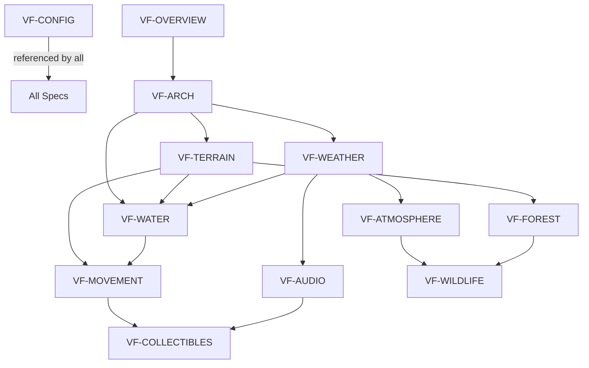

# VR Endless Forest — Specification Index

**Version:** 1.0  
**Date:** 20 February 2026  
**Status:** Active  

## Overview

The VR Endless Forest specification has been broken into self-contained documents. Each spec covers one system and can be read independently (with VF-CONFIG as the parameter reference).

## Conventions

Documents use **RFC 2119** language where noted:
- **MUST** / **MUST NOT** — absolute requirements
- **SHOULD** / **SHOULD NOT** — recommended but exceptions may exist
- **MAY** — truly optional

Cross-references use the format `see VF-WATER §3.2`.

## Specification Documents

| Document | Title | RFC 2119 | Description |
|----------|-------|----------|-------------|
| [VF-OVERVIEW](VF-OVERVIEW.md) | Overview & Conventions | No | Introduction, experience overview, coordinate system, teaching methodology |
| [VF-ARCH](VF-ARCH.md) | Architecture | Partial | System relationships, data flow, frame update order, dolly camera rig |
| [VF-TERRAIN](VF-TERRAIN.md) | Terrain System | Yes | Chunked infinite terrain, noise parameters, height calculation, altitude biomes, ground shader |
| [VF-WATER](VF-WATER.md) | Water System | Yes | Water plane, wave displacement, fragment effects, swimming, shore foam |
| [VF-FOREST](VF-FOREST.md) | Forest System | Yes | Tree types, placement algorithm, vegetation, wind animation |
| [VF-WILDLIFE](VF-WILDLIFE.md) | Wildlife | Yes | Bird flocks, peek encounters, spawn rules, animation |
| [VF-ATMOSPHERE](VF-ATMOSPHERE.md) | Atmosphere | Yes | Sky dome, day/night cycle, stars, clouds, fog, fireflies, shooting stars |
| [VF-WEATHER](VF-WEATHER.md) | Weather System | Yes | Weather state machine, rain, lightning, thunder, weather-driven parameters |
| [VF-AUDIO](VF-AUDIO.md) | Audio System | Yes | All procedural sounds, oscillator/filter chains, spatial audio |
| [VF-MOVEMENT](VF-MOVEMENT.md) | Movement & Input | Yes | VR/desktop controls, terrain following, collision, swimming, ski physics |
| [VF-COLLECTIBLES](VF-COLLECTIBLES.md) | Collectibles & HUD | Yes | Orbs, scoring, sprint power, persistence, minimap, HUD layout |
| [VF-PERFORMANCE](VF-PERFORMANCE.md) | Performance Budget | Yes | Quest 3 target, instance caps, draw call budget, optimisation table, tuning history |
| [VF-CONFIG](VF-CONFIG.md) | Configuration Reference | Yes | Complete table of ALL ~170 parameters with values and descriptions |
| [VF-VERIFY](VF-VERIFY.md) | Verification Guide | No | Per-system checklists, gotcha callouts, spot-checks, "What WRONG Looks Like" |

## Dependency Graph

## Status

VF-OVERVIEW through VF-MOVEMENT are at **1.0** — initial extraction from the monolithic specification. VF-COLLECTIBLES, VF-PERFORMANCE, VF-CONFIG, and VF-VERIFY are at **0.1 Draft**. Expect amendments as implementations discover gaps.
