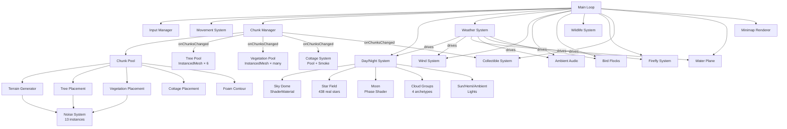
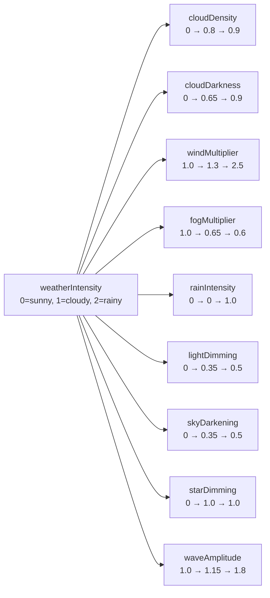
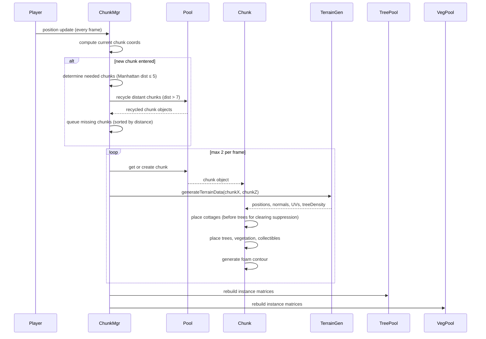

# VF-ARCH — Architecture

**Version:** 1.0  
**Date:** 20 February 2026  
**Status:** Active  
**Purpose:** System relationships, data flow, frame update order, dolly camera rig, and renderer configuration. Normative where it defines interfaces between systems.  
**Dependencies:** VF-OVERVIEW, VF-CONFIG  

---

## 1. System Overview



## 2. Module Structure

| Module | Role | Key Exports |
|--------|------|-------------|
| `config.js` | All tunable constants (~190 parameters) | `CONFIG` object |
| `vr-setup.js` | WebXR renderer, camera rig, controllers | `VRSetup` class |
| `input.js` | VR gamepad + keyboard/mouse input abstraction | `InputManager` class |
| `movement.js` | Player locomotion, physics, collision | `MovementSystem` class |
| `terrain/noise.js` | 13 seeded simplex noise instances | `getTerrainHeight()`, density functions |
| `terrain/terrain-generator.js` | Height, normal, UV generation per chunk | `generateTerrainData()` |
| `terrain/chunk.js` | Per-chunk mesh + object placement | `Chunk` class |
| `terrain/chunk-manager.js` | Dynamic chunk loading/unloading | `ChunkManager` class |
| `terrain/ground-material.js` | Shared ground material + procedural textures | `getGroundMaterial()` |
| `forest/tree-factory.js` | 3 procedural tree geometries + materials | Geometry/material getters |
| `forest/tree-pool.js` | InstancedMesh tree rendering | `TreePool` class |
| `forest/vegetation.js` | Grass, ferns, flowers, rocks, logs, foam | `VegetationPool` class |
| `forest/textures.js` | Procedural canvas textures | Texture creators |
| `forest/cottage-factory.js` | Procedural log cabin geometry + materials | `createCottageGeometry()`, material getters |
| `forest/cottage-system.js` | Cottage pool, smoke particles, emissive windows | `CottageSystem` class |
| `forest/birds.js` | Bird flock visual + crow audio | `BirdFlockSystem` class |
| `forest/wildlife.js` | Bear, lion, Wally peek encounters | `WildlifeSystem` class |
| `forest/collectibles.js` | Fairy orbs with collection mechanics | `CollectibleSystem` class |
| `atmosphere/day-night.js` | Sun/moon/stars, sky, palettes, clouds | `DayNightSystem` class |
| `atmosphere/star-catalog.js` | 438 real stars packed as binary catalog | `getStarCatalog()` |
| `atmosphere/weather.js` | Weather state machine, rain, thunder, lightning | `WeatherSystem` class |
| `atmosphere/audio.js` | All procedural audio | `AmbientAudio` class |
| `atmosphere/fireflies.js` | Night-time glowing particles | `FireflySystem` class |
| `atmosphere/wind.js` | Vertex shader wind displacement | `addWindToMaterial()`, `updateWind()` |

## 3. Data Flow: Weather → Everything

Weather is the most interconnected system. A single `weatherIntensity` float (0–2) drives all weather parameters:



Other systems MUST **pull** from weather each frame — weather MUST NOT push. This keeps coupling minimal.

## 4. Weather State Machine

```mermaid
stateDiagram-v2
    [*] --> Sunny: startup
    Sunny --> Transitioning_Up: holdTimer expired
    Transitioning_Up --> Cloudy: weatherIntensity reaches 1.0
    Cloudy --> Transitioning_Up2: holdTimer expired (50% chance)
    Cloudy --> Transitioning_Down: holdTimer expired (50% chance)
    Transitioning_Up2 --> Rainy: weatherIntensity reaches 2.0
    Transitioning_Down --> Sunny: weatherIntensity reaches 0.0
    Rainy --> Transitioning_Down2: holdTimer expired
    Transitioning_Down2 --> Cloudy: weatherIntensity reaches 1.0
    
    note right of Sunny: Hold 3-8 min
    note right of Cloudy: Hold 3-8 min
    note right of Rainy: Hold 3-8 min
    note left of Transitioning_Up: Rate: 0.0083/s (~2 min)
```

See VF-WEATHER for the full state machine specification.

## 5. Chunk Lifecycle



See VF-TERRAIN §1 for chunk loading/unloading details.

## 6. Audio Signal Flow

```mermaid
graph TB
    subgraph "Footsteps"
        FS_Heel[Heel Oscillator] --> FS_Mix[Footstep Mixer]
        FS_Toe[Toe Oscillator] --> FS_Mix
        FS_Tex[Texture Noise] --> FS_BP1[Bandpass] --> FS_Mix
    end
    
    subgraph "Ambient"
        Wind_N[Noise Buffer] --> Wind_BP[Bandpass 250-650Hz] --> Wind_G[Gain LFO]
        Cricket_Osc[4× Sine 4200-5400Hz] --> Cricket_G[Gain Envelope]
        Water_N[Noise Buffer 0.3×] --> Water_BP[Bandpass 280Hz] --> Water_LP[Lowpass 400Hz] --> Water_Env[Wave Envelope]
    end
    
    subgraph "Rain"
        R1[Noise 0.6×] --> R1_BP[BP 800Hz] --> Rain_Mix[Rain Mixer]
        R2[Noise 0.9×] --> R2_BP[BP 1600Hz] --> R2_LFO[LFO 0.15Hz] --> Rain_Mix
        R3[Noise 1.2×] --> R3_BP[BP 3200Hz] --> Rain_Mix
        R4[Noise 1.8×] --> R4_HP[HP 6000Hz] --> R4_LFO[LFO 0.22Hz] --> Rain_Mix
    end
    
    subgraph "Thunder"
        T1[Noise 1.8-2.3×] --> T1_HP[HP 2000Hz] --> Thunder_Mix[Thunder Mixer]
        T2[Noise 0.15-0.25×] --> T2_LP[LP 120-200Hz] --> Thunder_Mix
        T3[Noise 0.35-0.5×] --> T3_BP[BP 180-280Hz] --> Thunder_Mix
        T4[Noise 0.2-0.35×] --> T4_BP[BP descending] --> Thunder_Mix
        T5[Sine 35-50Hz] --> Thunder_Mix
        Thunder_Mix --> Convolver[ConvolverNode<br/>5s impulse response]
    end
    
    subgraph "Spatial"
        Bird_Saw[Sawtooth] --> Bird_BP[BP 600Hz] --> Bird_Pan[HRTF Panner]
        Bird_Sq[Square 1.01×] --> Bird_BP
        Drip_Sin[Sine 2-5kHz] --> Drip_Pan[HRTF Panner]
        Owl_Buf[Morepork Buffer] --> Owl_Pan[HRTF Panner]
    end
    
    FS_Mix --> Master[Master Gain 0.3]
    Wind_G --> Master
    Cricket_G --> Master
    Water_Env --> Master
    Rain_Mix --> Master
    Convolver --> Master
    Bird_Pan --> Spatial_Bus[Spatial Bus] --> Master
    Drip_Pan --> Spatial_Bus
    Owl_Pan --> Spatial_Bus
    Master --> Destination[AudioContext.destination]
```



See VF-AUDIO for full synthesis chain specifications.

## 7. Frame Update Order

The order of operations within each frame matters. Dependencies between systems mean certain updates MUST happen before others:

```
1.  Input polling
    - Read VR controller state / keyboard+mouse state
    - Detect button edges (press, release)

2.  Movement
    - Apply locomotion (direction × speed × delta)
    - Tree collision (slide-along)
    - Jump physics (gravity, landing detection)
    - Terrain following (lerp Y toward ground)
    - Swimming detection and float
    - Ski physics (slope-driven velocity)
    - Walk bob phase advance

3.  Chunk management
    - Check if player entered new chunk
    - Queue/process chunk loads (max 2 per frame)
    - Fire onChunksChanged → rebuild instance meshes

4.  Water plane positioning
    - Snap water mesh to grid around player (prevents wave sliding)

5.  Heightmap update
    - If player moved >5m: regenerate 16 rows of heightmap texture

6.  Weather update
    - Advance state machine timer
    - Ramp weatherIntensity toward target
    - Derive all weather parameters
    - Update rain particles (positions, shelter check)
    - Check lightning timer, spawn bolts/flashes
    - Update ground wetness

7.  Day/night update
    - Compute sun/moon positions from real time + offset
    - Blend colour palettes
    - Apply weather modifications to palette
    - Update sky dome uniforms
    - Update fog colour and distance
    - Update directional/hemisphere/ambient lights
    - Update clouds (position, tint, opacity)
    - Update star visibility and shooting stars

8.  Wind
    - Advance uWindTime uniform
    - Update uWindStrength from weather
    - Drift wind direction

9.  Creature updates
    - Birds: orbit positions, flap animation, mountain avoidance
    - Wildlife: spawn timer, peek animation states
    - Fireflies: position drift, glow pulse

10. Audio
    - Footstep trigger check (bob phase zero-crossing)
    - Cricket burst scheduling
    - Bird chirp timer
    - Morepork conversation timer
    - Water ambient wave pulse
    - Rain layer gain updates
    - Spatial drip spawning
    - Wind modulation
    - Ski slide sound

11. Cottage system
    - Smoke particle animation (rise, drift, fade, respawn)
    - Window emissive intensity update (tracks sun elevation)

12. Collectible animation
    - Update orb positions (bob, drift)
    - Check collection (distance to player)

13. Minimap
    - Every 10th frame: render minimap canvas

14. GPU render
    - Submit draw calls
```

**Why this order**: Movement MUST happen before chunk management (so chunks load around the player's new position). Weather MUST update before day/night (because weather modifies palette outputs). Wind MUST update before rendering (so vertex shaders have current values).

## 8. The Dolly Camera Rig

The VR camera rig uses the "dolly pattern" — a `Group` that holds the camera and controllers. The headset controls camera rotation/position within the dolly; code moves the dolly to move the player.

## 9. Renderer Configuration

| Setting | Value | Why |
|---------|-------|-----|
| Antialiasing | Enabled | Thin tree branches alias badly without it |
| Pixel ratio | min(devicePixelRatio, 2) | Beyond 2× is wasted on VR headsets |
| Colour space | sRGB | MUST match sky shader's manual conversion |
| Shadow map type | PCFSoftShadowMap | Soft edges hide the low 2048 resolution |
| Shadow map size | 2048×2048 | Halved from 4096 for Quest performance |
| Shadow camera bounds | ±80m, near 0.5, far 250 | Covers the visible terrain |
| Shadow bias | -0.002 | Prevents shadow acne on terrain |
| Shadow normal bias | 0.03 | Prevents peter-panning on tree trunks |
| Camera FOV | 70° | Standard for non-VR; VR overrides this |
| Camera near plane | 0.1m | Close enough for vegetation detail |
| Camera far plane | 250m | MUST match fog far distance (see below) |
| XR reference space | `local-floor` | Player starts standing at ground level |
| Foveated rendering | Level 1 | Saves GPU on peripheral vision (Quest) |
| Render order | Sky dome (-2) → Water plane (-1) → Everything else (0) | Ensures correct layering |

> ⚠️ **Gotcha: Camera far plane.** Increasing the far plane to 600m (to see distant mountains) caused the entire sky to go black on one platform due to depth buffer precision loss. The sky dome (radius 200m) needs sufficient Z precision. Keep the far plane at 250m and use fog to hide the boundary.

### Shadow Stabilisation

To prevent "shadow swimming" (visible shadow banding that shifts with sub-texel player movement), the shadow camera MUST be snapped to texel grid boundaries each frame:

```
texelSize = (shadowCam.right - shadowCam.left) / shadowMapWidth
// Transform shadow target to light view space
pos = lightTarget.applyMatrix4(shadowCam.matrixWorldInverse)
// Snap to grid
pos.x = round(pos.x / texelSize) × texelSize
pos.y = round(pos.y / texelSize) × texelSize
// Transform back and apply offset
```
