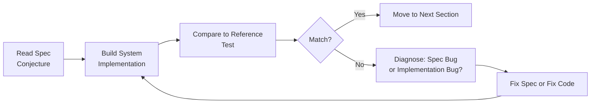
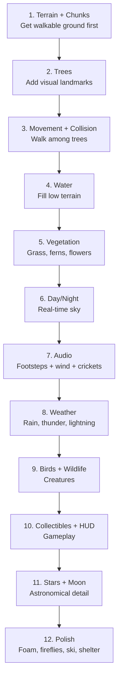

# VF-OVERVIEW — Introduction & Conventions

**Version:** 1.0  
**Date:** 20 February 2026  
**Status:** Active  
**Purpose:** Narrative overview of the VR Endless Forest experience, coordinate conventions, and teaching methodology. This document is NOT normative — it uses no RFC 2119 language.  
**Dependencies:** None (this is the starting point)  

---

## 1. What This Document Is

This is a complete technical specification for a procedurally-generated VR forest experience. It describes every system, algorithm, parameter, and design decision in enough detail that a developer could rebuild the experience on any platform (Godot, Unity, Unreal, custom engine) without seeing the reference implementation's source code.

The reference implementation uses Three.js r170 + WebXR + Web Audio API.

## 2. The Teaching Methodology

This spec is used in an educational exercise built on Karl Popper's philosophy of **conjecture and refutation** applied to software:

1. **Students read only this spec** — they never see the Three.js source code
2. **They pick a platform** (Godot, Unity, etc.) and **rebuild the experience**
3. **Where their build diverges from the reference**, it's the **spec's fault** — the spec was ambiguous, incomplete, or wrong
4. **Improving the spec is part of the assignment** — students submit spec patches alongside their builds

The spec is the conjecture. Your implementation is the test. Divergence is falsification. Fixing the spec is science.



### How AI Fits In

You are encouraged to use AI coding assistants (Claude, Copilot, etc.) to help implement this spec. This mirrors how the original was built. The workflow:

1. Give the AI a section of this spec
2. Ask it to implement that system in your chosen platform
3. Test the result against the verification checklist (see VF-VERIFY)
4. When something doesn't match, show the AI the discrepancy and iterate

**What the AI is good at**: Translating algorithmic descriptions into platform-specific code. Converting GLSL to Godot shaders or Unity compute shaders. Getting the maths right.

**What the AI is bad at**: Judging whether something *feels* right. Knowing if the footsteps sound like "a drum" or like real grass. Sensing that the wind is too strong. These judgements require you testing the build and providing feedback.

### How to Treat Discrepancies

When your build diverges from the reference:

1. Check the verification list first (see VF-VERIFY) — many common failures are documented
2. Check the "What WRONG Looks Like" table (see VF-VERIFY §8)
3. Re-read the spec section carefully — you may have missed a parameter or condition
4. If the spec is genuinely ambiguous or missing information, document the gap

### The Spec Is a Living Document

The original implementation went through dozens of iterations on most systems. The spec captures the *final* state, not the journey — but the journey is where the learning happens.

## 3. How to Read the Specification

- **Read this document first** to understand what you're building
- **Read VF-ARCH** to understand how systems relate
- **Then dive into individual system specs** as you implement them
- **VF-CONFIG** is your parameter bible — every magic number lives there
- **VF-VERIFY** tells you how to check your work

## 4. Experience Overview

Imagine putting on a VR headset and finding yourself standing in a forest clearing. It's whatever time of day it actually is where you are — if you play at sunset, the sky blazes orange. If you play at midnight, you're in darkness.

**The terrain** rolls away in every direction — gentle hills carpeted in grass, punctuated by clusters of pine, oak, and birch trees. Walk in any direction and the world keeps generating. After a few minutes you notice stream channels winding between the hills, with sandy shores where the terrain dips below the water level. The streams connect into ponds that shimmer with multi-directional waves.

**The mountains** appear as you walk further from the origin. Ridge after ridge of peaks rise from the landscape, transitioning through altitude zones: dark subalpine forest, tussock grassland, exposed alpine rock, and finally snow. The snow is bright — almost glowing — and when you walk on it, your movement changes: reduced friction lets you ski downhill, carving through powder with momentum.

**The sky** is accurate. The sun's position is calculated from your real clock and GPS coordinates (Auckland, New Zealand as fallback). Stars are real constellations — 438 stars from the HYG database, placed at their correct J2000 equatorial positions and rotated by local sidereal time. From the southern hemisphere, you can find the Southern Cross. The moon tracks its real orbital position with a photograph-based phase shader.

**Weather changes.** The system auto-cycles between sunny, cloudy, and rainy states over 3–8 minute intervals. During storms, rain falls as thin vertical streaks (or snow above the snowline), thunder cracks with 5-layer procedural audio through a convolver reverb, lightning bolts flash with jagged geometry, and the ground gradually darkens with wetness. Under dense tree canopy, rain is mostly blocked — you can shelter from the storm.

**Sound is everywhere.** Footsteps change with the surface — soft thuds on grass, sharp taps on rock, squelching slosh in water, crunchy crunch in snow. Crickets chirp at dusk (4200–5400 Hz sine waves). Bird flocks circle overhead with harsh crow caws. At night, from somewhere distant in the trees, a morepork owl calls — New Zealand's native owl — and another answers from a different direction.

**Small details.** Rare ramshackle log cabins appear in forest clearings — stacked-log walls, sagging roofs, leaning chimneys with wisps of smoke. Amber windows glow at night. The ground around them is warm earthy garden soil. Fairy-like collectible orbs glow and flutter in seven colours. Fallen logs and tree stumps litter the forest floor. Fireflies pulse at night. Occasionally, a bear, mountain lion, or Where's Wally peeks out from behind a tree, watches you for a few seconds, then hides again.

**Everything is procedural.** No 3D models, no pre-made textures (except one moon photograph with a procedural fallback), no pre-recorded sounds (except one owl call). Every texture is painted on a canvas at startup. Every sound is synthesised from oscillators, noise, and filters. The entire project is ~450KB of code.

## 5. Conventions

- All distances are in **meters**
- All angles are in **radians** unless noted as degrees
- Time values are in **seconds** unless noted otherwise
- Colours are given as normalised RGB (0–1) or hex (0xRRGGBB)

## 6. Coordinate System

The scene uses a specific coordinate convention that affects multiple systems:

```
+X = North (azimuth 0°)
+Z = East  (azimuth 90°)
+Y = Up
```

This convention was chosen because it makes astronomical calculations natural: `azimuth 0 → cos(0) = 1 on X axis = North`. But it creates potential confusion because many 3D engines use +Z as "forward" or "North."

**Systems that depend on coordinate convention:**
1. **Sun position**: `x = cos(azimuth) × cos(elevation)`, `z = sin(azimuth) × cos(elevation)`
2. **Moon position**: Same azimuth mapping
3. **Star rotation**: Euler 'ZYX' — Z carries latitude tilt toward North (+X)
4. **Minimap North**: The "N" indicator points toward +X
5. **Wind direction**: Sinusoidal drift around +X base

**If you get coordinates wrong**, the sun will rise in the wrong compass direction, the Southern Cross will appear in the northern sky, or the minimap North will point East. These are some of the most subtle bugs to track down because the visuals still look plausible — just geographically wrong.

## 7. What This Spec Does NOT Cover

- **Platform-specific implementation details**: How to set up a VR project in Godot/Unity/Unreal
- **Asset pipeline**: How to create and load procedural textures in your platform
- **Shader language translation**: The algorithms are given in GLSL-like pseudocode; translation to your platform's shader language is your job
- **Audio API differences**: Web Audio API concepts (oscillators, buffer sources, biquad filters, HRTF panners) need translation to your platform's audio system
- **Deployment**: How to build and deploy for VR hardware

These gaps are intentional — they are the platform-specific work that makes the exercise educational.

## 8. Suggested Build Order

Based on the original development arc and dependencies between systems:



Each step builds on the previous. Don't skip ahead — the later systems depend on earlier ones being correct.

## 9. A Note on Subjective Quality

Many aspects of this experience — the sound of footsteps, the colour of the sky at dusk, the feeling of wind animation — are fundamentally subjective. The spec provides exact parameters, but the *rightness* of the result can only be judged by putting on the headset and walking through the forest.

If something feels wrong, it probably is. Trust your instincts. The original developer's most useful feedback was always experiential: "sounds like someone farting," "looks like alien life forms," "reminds me of bats." These imprecise descriptions led to precise fixes. Your gut feeling is a legitimate debugging tool in creative work.

## 10. Lessons from Development

These lessons are drawn from the seven-day build process. They represent hard-won knowledge about what goes wrong and why.

### Sound Is Harder Than Visuals

Procedural audio proved consistently more difficult than procedural visuals. The human ear is more discriminating than the eye for procedural generation. A slightly wrong noise frequency or envelope shape is immediately perceived as "wrong" even if the listener can't explain why.

**Practical implication**: Budget 2–3× more iteration time for audio than for equivalent visual systems. Test audio with headphones, not laptop speakers.

### VR Is an Unforgiving Medium

Features that work on a desktop monitor break in VR:
- Walk bob applied to the camera rig makes the world bob
- Stencil-based effects render in only one eye
- Height/scale mismatches are immediately obvious when you're "standing there"
- Frame rate drops below 90fps cause nausea
- `mediump` float precision on mobile GPUs breaks hash functions

**Practical implication**: Test in VR early and often. Don't develop the entire experience on desktop and assume it'll work in VR.

### Weather × Time of Day Is a Matrix

A weather system that looks correct during daytime sunny weather will often produce wrong results during nighttime rain. Every weather×time combination needs to look right independently. The original implementation went through 7 iterations on sky/fog colour convergence across this matrix.

**Practical implication**: Test your weather system at night. Test it during rain. Test it during rain at night. Test rain at twilight. Each combination exercises different code paths.

### What Makes Water Sound Like Water

It's not a frequency spectrum — it's a temporal pattern. The rhythmic advance-and-retreat of waves meeting a shore is what the brain recognises. No amount of spectral filtering on continuous noise will produce this. You must move from the frequency domain to the time domain: shape the *envelope* (rhythmic pulses with gaps), not just the *filter*.

### Fog Is Your Friend

Fog does triple duty:
1. It hides chunk load/unload boundaries (no pop-in)
2. It matches the sky at the horizon (no hard edge between ground and sky)
3. It reduces rendering workload (fewer distant objects visible)

Don't fight fog — embrace it. Many visual "fixes" in the reference implementation were actually fog adjustments.

### Don't Skip the Boring Parts

The terrain system is the least exciting but most important thing to get right. If your terrain has seams, wrong normals, or inconsistent height sampling, every system built on top of it will inherit those problems — trees will float, water will clip through terrain, collision will feel wrong. Invest in getting terrain right before making it pretty.

### The 80/20 of Procedural Geometry

A tree made from 5 cones reads as "pine" instantly. A tree made from 6 icosahedron spheres reads as "oak." A few hundred triangles of procedural geometry is enough for VR when combined with:
- Vertex colour variation (not flat shading)
- Per-instance randomised rotation and scale
- Proper instanced rendering
- Wind animation
- Fog softening at distance

Don't over-invest in geometry complexity. The reference implementation's most complex single mesh (a fern) is ~500 triangles. Most vegetation is under 100.

## Appendix: Glossary

| Term | Meaning |
|------|---------|
| **fBm (Fractal Brownian Motion)** | Layering multiple octaves of noise at increasing frequency and decreasing amplitude. Creates natural-looking terrain with both large hills and small bumps. |
| **Simplex noise** | A smooth, continuous noise function that maps any coordinate to a value between -1 and 1. Similar to Perlin noise but faster and without directional artifacts. |
| **Domain warping** | Adding a noise-based offset to coordinates *before* sampling another noise function. Makes straight features (ridges, channels) curve and meander. |
| **Ridge noise** | `1 - |noise|` — creates sharp ridges along the zero-crossings of the underlying noise. Used for stream channels (carving down) and mountain chains (pushing up). |
| **Instanced rendering** | Drawing many copies of the same geometry in a single GPU draw call, each with a different position/rotation/scale. Essential for thousands of trees and vegetation. |
| **InstancedMesh** | The Three.js class for instanced rendering. Each instance has a 4×4 transformation matrix. |
| **HRTF (Head-Related Transfer Function)** | Audio spatialization that simulates how sound reaches each ear differently based on direction. Creates convincing 3D audio positioning. |
| **PannerNode** | Web Audio API node that spatially positions a sound in 3D space. With `panningModel: 'HRTF'`, it uses the built-in HRTF dataset. |
| **Dolly pattern** | A Group node that acts as the player's body. The VR camera is a child of the dolly. Moving the dolly moves the player; the headset controls the camera within it. |
| **Marching squares** | A 2D contour-tracing algorithm. Samples a scalar field at grid corners and finds where it crosses a threshold, producing line segments along the boundary. Used here for waterline foam. |
| **ConvolverNode** | Web Audio API node that applies a reverb impulse response to audio. The impulse response is a recording (or simulation) of how sound reverberates in a space. |
| **sRGB transfer function** | The standard non-linear encoding for display colours. Linear light values must be converted to sRGB before display. The piecewise function (not simple gamma) is important for dark values. |
| **Shadow acne / Peter panning** | Shadow mapping artifacts. Acne: surface incorrectly shadows itself (sparkly noise). Peter panning: shadow detaches from object base. Fixed with bias and normal bias. |
| **Foveated rendering** | Reducing resolution in the peripheral vision of a VR headset. The eye focuses on a small central area; lower resolution at the edges is imperceptible but saves significant GPU work. |

## Appendix: External Dependencies

| Dependency | Purpose | Minimum Version |
|------------|---------|----------------|
| Three.js (or equivalent 3D engine) | 3D rendering, WebXR | r170 |
| simplex-noise (or equivalent) | 2D simplex noise | 4.0.3 |

### External Assets

| Asset | Source | Purpose | Fallback |
|-------|--------|---------|----------|
| `assets/textures/moon.jpg` | Wikipedia | Moon disc texture | Procedural: grey disc with dark mare ellipses, crater dots, ray systems |
| `assets/audio/morepork-single.mp3` | Field recording | NZ owl night call | Silent (feature disabled) |

---

*Where this spec came from: This specification was reverse-engineered from a working implementation — not written before it. The VR Endless Forest was built over seven days (10–20 February 2026) through conversational iteration between a human creative director and an AI coding assistant. No code was written directly by the human. The spec was then extracted by reading every line of the ~12,100-line codebase across 26 modules.*
